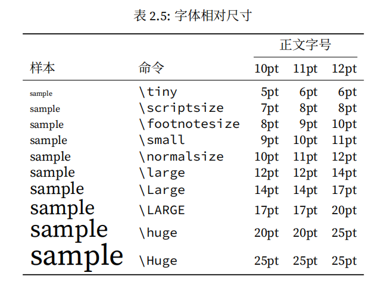
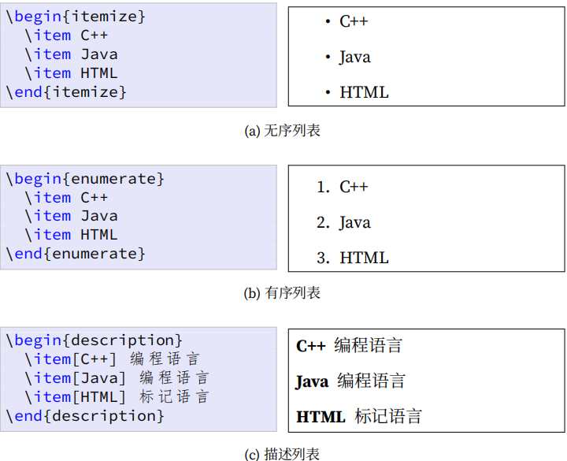

<h1 align="center">LaTex Learning</h1>

## 参考书籍：LATEX NOTES 雷太赫排版系统简介（第二版） (包太雷)

# 入门

文档类声明**P19**：options能确定“正文字号、纸张尺寸、标题后另起新页、栏数、横向打印、章节起始页（奇数、偶数、任意页）、草稿模式等”

```
\documentclass[options]{class}
%class包含article、book、report，用中文文档类对应是ctexart、ctexbook、ctexrep
```


要正确显示中文：选择XeLaTeX

```
\usepackage[UTF8]{ctex} % 中文支持宏包\newpage  % 换页
```

标题、作者、日期、摘要**P20**

```
\title{LaTeX Notes}%标题
\author{Alpha Huang}%作者
\date{\today}%日期
%上面语句就在导言区
\maketitle%另起标题页（在正文区）
%摘要（book 里没有）
\begin{abstract}
...
\end{abstract}
```

标题层次：article 中没有 chapter，而 report 和 book 则支持所有层次。

```
\part{...} %Level -1
\chapter{...} %Level 0
\section{...} %Level 1
\subsection{...} %Level 2
\subsubsection{...} %Level 3
\paragraph{...} %Level 4
\subparagraph{...} %Level 5
```

```
%标题设置技巧
\part*{总纲}%加“*”会取消自带的编号，只出现“总纲”，但如果要添加进目录就要手动加
```

目录

```
\setcounter{tocdepth}{2} %设 定 目 录 深 度
\tableofcontents %列 出 目 录
%手动添加目录
\addcontentsline{〈文件〉}{〈层级〉}{〈标题文字〉}
```

# 2.3 文字

### 2.3.1 字符输入

有些字符(例如# $ % ^ & _ { } ~等)被用作特殊的控制符，大多前面要加"\"转义；短划线"-",中划线重复两次短划线，长划线（破折号）重复三次。

### 2.3.2 字体样式和大小

衬线字体笔画的边缘部分有些修饰，类似于中文的宋体、仿宋、楷体、魏体等；无衬线字体的笔画则是平滑的，类似于中文的黑体。

字体强调命令：

```
\usepackage{ulem}%导入包
\emph{emphasis}%与周围字体正/斜体相反
\uline{underline}%下划线
\uwave{waveline}%下划波浪线
\sout{strike-out}%删除线
```

字号：



### 2.3.3 换行、换页和断字

换行：\\\或\newline；换页：\newpage；断句：\hyphenation{BASIC blar-blar-blar}显式指明断字位置，BASIC 这个词不能断开，blar‐blar‐blar 可以在‐处断开。（这个断句要在导言区设置）

## 2.4 长度

## 2.5 对齐和间距

### 2.5.1段落对齐

```
\begin{flushleft}
居左\\段落
\end{flushleft}

\begin{center}
居中\\段落
\end{center}


\begin{flushright}
居右\\段落
\end{flushright}
```

### 2.5.2 缩进和段落间距

```
%在标准Latex每个章节、节标题之后的第一个段落默认不缩进，解决办法，引入indentfirst
\usepackage{indentfirst}
%控制缩进
\setlength{\parindent}{2em}
%控制段间距
\addtolength{\parskip}{3pt}
%如果要局部设置————使用“{}”进行局部设置
{\setlength{\parindent}{0em}    % 局部：取消缩进
 \setlength{\parskip}{1em}      % 局部：增大段距
 这是局部修改后的第一段。
 
 这是局部修改后的第二段。}
```

### 2.5.3 行间距

① 原生命令：缺省默认是单倍行距，不仅会改变正文行距，同时也把目录、脚注、图表、标题等的行距给改了。

```
\linespread{1.3} %一 倍 半 行 距
\linespread{1.6} %双 倍 行 距
```

② 加载宏包，可以先全局设置，然后再局部设置（推荐）

```
\usepackage{setspace}
\singlespacing %单 倍 行 距
\onehalfspacing %一 倍 半 行 距
\doublespacing %双 倍 行 距
\setstretch{1.25} %任 意 行 距
```

```
%局部控制行距
\begin{doublespacing}
double\\spacing
\end{doublespacing}
```

## 2.6 特殊段落

### 2.6.1 摘录（如引用诗歌）

LATEX 中有三种摘录环境：quote, quotation, verse。quote 两端都缩进，quotation 在 quote 的基础上增加了首行缩进，verse 比 quote多了第二行起的缩进。

```
\begin{quote}
引文两端\\都缩进。
\end{quote}
```

### 2.6.2 原文打印

就是让文本**不被解释、不被格式化，原样输出**。

### 2.6.3 脚注

重定义命令中可更改“roman”，阿拉伯数字对应**arabic**；小写英文字母对应**alph**；大写英文字母对应**Alph**；小写罗马数字对应**roman**；大写罗马数字对应**Roman**。

```
\renewcommand{\thefootnote}{\roman{footnote}} %设置脚注格式
正文\footnote{脚注}%使用footnote命令
```

### 2.6.4 边注

```
%主要是\marginpar 命令
\marginnote{正常边注}
\reversemarginpar
\marginnote{反向边注}
\normalmarginpar
```

### 2.6.5 注释

%可以用于注释，但是对于大段的注释使用：

```
\begin{comment}
...
\end{comment}
```

## 2.7 列表

### 2.7.1 基本列表

有三种基本列表环境：无序列表、有序列表、描述列表。这些列表可以单独使用，也可以互相嵌套。



## 2.7.2 其他列表

paralist 宏包提供了一系列压缩列表和行间列表环境。

## 2.7.3 定制列表

如要改变无序列表的列表符号和有序列表的编号形式
