<h1 align="center">LaTex Learning</h1>

## 参考书籍：LATEX NOTES 雷太赫排版系统简介（第二版） (包太雷)

# 2 入门

文档类声明**P19**：options能确定“正文字号、纸张尺寸、标题后另起新页、栏数、横向打印、章节起始页（奇数、偶数、任意页）、草稿模式等”

```
\documentclass[options]{class}
%class包含article、book、report，用中文文档类对应是ctexart、ctexbook、ctexrep
```


要正确显示中文：选择XeLaTeX

```
\usepackage[UTF8]{ctex} % 中文支持宏包\newpage  % 换页
```

标题、作者、日期、摘要**P20**

```
\title{LaTeX Notes}%标题
\author{Alpha Huang}%作者
\date{\today}%日期
%上面语句就在导言区
\maketitle%另起标题页（在正文区）
%摘要（book 里没有）
\begin{abstract}
...
\end{abstract}
```

标题层次：article 中没有 chapter，而 report 和 book 则支持所有层次。

```
\part{...} %Level -1
\chapter{...} %Level 0
\section{...} %Level 1
\subsection{...} %Level 2
\subsubsection{...} %Level 3
\paragraph{...} %Level 4
\subparagraph{...} %Level 5
```

```
%标题设置技巧
\part*{总纲}%加“*”会取消自带的编号，只出现“总纲”，但如果要添加进目录就要手动加
```

目录

```
\setcounter{tocdepth}{2} %设 定 目 录 深 度
\tableofcontents %列 出 目 录
%手动添加目录
\addcontentsline{〈文件〉}{〈层级〉}{〈标题文字〉}
```

## 2.3 文字

### 2.3.1 字符输入

有些字符(例如# $ % ^ & _ { } ~等)被用作特殊的控制符，大多前面要加"\"转义；短划线"-",中划线重复两次短划线，长划线（破折号）重复三次。

### 2.3.2 字体样式和大小

衬线字体笔画的边缘部分有些修饰，类似于中文的宋体、仿宋、楷体、魏体等；无衬线字体的笔画则是平滑的，类似于中文的黑体。

字体强调命令：

```
\usepackage{ulem}%导入包
\emph{emphasis}%与周围字体正/斜体相反
\uline{underline}%下划线
\uwave{waveline}%下划波浪线
\sout{strike-out}%删除线
```

字号：


### 2.3.3 换行、换页和断字

换行：\\\或\newline；换页：\newpage；断句：\hyphenation{BASIC blar-blar-blar}显式指明断字位置，BASIC 这个词不能断开，blar‐blar‐blar 可以在‐处断开。（这个断句要在导言区设置）

## 2.4 长度

## 2.5 对齐和间距

### 2.5.1段落对齐

```
\begin{flushleft}
居左\\段落
\end{flushleft}

\begin{center}
居中\\段落
\end{center}


\begin{flushright}
居右\\段落
\end{flushright}
```

### 2.5.2 缩进和段落间距

```
%在标准Latex每个章节、节标题之后的第一个段落默认不缩进，解决办法，引入indentfirst
\usepackage{indentfirst}
%控制缩进
\setlength{\parindent}{2em}
%控制段间距
\addtolength{\parskip}{3pt}
%如果要局部设置————使用“{}”进行局部设置
{\setlength{\parindent}{0em}    % 局部：取消缩进
 \setlength{\parskip}{1em}      % 局部：增大段距
 这是局部修改后的第一段。

 这是局部修改后的第二段。}
```

### 2.5.3 行间距

① 原生命令：缺省默认是单倍行距，不仅会改变正文行距，同时也把目录、脚注、图表、标题等的行距给改了。

```
\linespread{1.3} %一 倍 半 行 距
\linespread{1.6} %双 倍 行 距
```

② 加载宏包，可以先全局设置，然后再局部设置（推荐）

```
\usepackage{setspace}
\singlespacing %单 倍 行 距
\onehalfspacing %一 倍 半 行 距
\doublespacing %双 倍 行 距
\setstretch{1.25} %任 意 行 距
```

```
%局部控制行距
\begin{doublespacing}
double\\spacing
\end{doublespacing}
```

## 2.6 特殊段落

### 2.6.1 摘录（如引用诗歌）

LATEX 中有三种摘录环境：quote, quotation, verse。quote 两端都缩进，quotation 在 quote 的基础上增加了首行缩进，verse 比 quote多了第二行起的缩进。

```
\begin{quote}
引文两端\\都缩进。
\end{quote}
```

### 2.6.2 原文打印

就是让文本**不被解释、不被格式化，原样输出**。

### 2.6.3 脚注

重定义命令中可更改“roman”，阿拉伯数字对应**arabic**；小写英文字母对应**alph**；大写英文字母对应**Alph**；小写罗马数字对应**roman**；大写罗马数字对应**Roman**。

```
\renewcommand{\thefootnote}{\roman{footnote}} %设置脚注格式
正文\footnote{脚注}%使用footnote命令
```

### 2.6.4 边注

```
%主要是\marginpar 命令
\marginnote{正常边注}
\reversemarginpar
\marginnote{反向边注}
\normalmarginpar
```

### 2.6.5 注释

%可以用于注释，但是对于大段的注释使用：

```
\begin{comment}
...
\end{comment}
```

## 2.7 列表

### 2.7.1 基本列表

有三种基本列表环境：无序列表、有序列表、描述列表。这些列表可以单独使用，也可以互相嵌套。


## 2.7.2 其他列表

paralist 宏包提供了一系列压缩列表和行间列表环境。

## 2.7.3 定制列表

如要改变无序列表的列表符号和有序列表的编号形式

# 2.8盒子

在 LaTeX 里，“盒子（box）”就是排版的最小单位，所有的文字、图片、表格最终都被打包成盒子再排列组合。

## 2.8.1 初级盒子

最简单的盒子命令是 \mbox（水平盒子，保证在一行内显示内容）和 \fbox。前者把一组对象组合起来，后者在此基础上加了个边框。

## 2.8.2 中级盒子

对齐方式有居中 (缺省) 、居左、居右和分散对齐，分别用 c, l, r,s 来表示。

```
%语法：[宽度][对齐方式]{内容}
\makebox[100pt][c]{仪仗队}
\framebox[100pt][s]{仪仗队}
```

## 2.8.3高级盒子

整个段落可以用 \parbox 命令或 minipage 环境。外部对齐（盒子与盒子）：居顶、居中和居底对齐，分别用 t, c, b 来表示；内部对齐也是。

外部对齐：t——盒子顶部与其他盒子顶部对齐；c——盒子中线与其他盒子中线对齐；b——盒子底部与基线对齐

内部对齐：t——内容贴近盒子上边缘；c——内容居中放置；b——内容贴近盒子下边缘

```
%语法：[外部对齐][高度][内部对齐]{宽度}{内容}
\fbox{%带外框的盒子
\parbox[c][36pt][t]{170pt}{
锦瑟无端五十弦，一弦一柱思华年。庄生晓梦迷蝴蝶，望帝春心托杜鹃。
 }%
}
\hfill%在当前行中插入一个可以自动拉伸（或压缩）的空白，用来推开两侧的内容，使它们尽量靠两边分布
\fbox{%
\begin{minipage}[c][36pt][b]{170pt}
沧海月明珠有泪，蓝田日暖玉生烟。此情可待成追忆，只是当时已惘然。
\end{minipage}%
}
```

## 2.9 交叉引用

核心命令：`\label{标识符}` —— 打标签；`\ref{标识符}` —— 引用编号；`\pageref{标识符}` —— 引用页码。只适用于文档内的图、表、公式

```
%例子介绍
\label{sec:intro}
如图~\ref{fig:setup}~所示
第~\pageref{fig:setup}~页
```

\label会给当前对象（例如章节、图、表、公式）打上一个唯一的“内部标签，会记录该对象的编号和页码。\ref提取编号，\pageref提取页码。

其中“~”：**不换行空格**，常用于让编号和前缀（如“图”“表”“式”）粘在一起，防止被拆行

补充参考文献的引用：

```
\cite{标签}
\begin{thebibliography}{99}%中括号内表示
\bibitem{标签}
\end{thebibliography}
```

其中\cite{标签1，标签2}可以引用多个参考文献；

要实现上标形式和方括号

第一种方法：

```
\usepackage[square,super,comma]{natbib}  % 上标 + 方括号 + 多条合并
```

第二种方法：`iblatex` 宏包 + `biber` 编译

# 3 字体

## 3.1 编码

推荐采用UTF-8格式，现代引擎XeLaTeX / LuaLaTeX，直接

```
\documentclass{ctexart}   % 已自动支持 UTF-8 编码
```

## 3.2 字体格式

### 3.2.1 点阵和矢量字体

 点阵字体是由像素点组成，放大会有锯齿状；轮廓字体又称作矢量字体矢量，缩放平滑，文件稍大。

## 3.2.2 常见字体格式

当前常见的轮廓字体格式有：Type 1, TrueType, OpenType。

### 3.2.3 合纵连横

## 3.3 常见字体

## 3.4 字体的应用

## 3.5 中文解决方案

# 4 数学

**在线公式编辑器：[在线LaTeX公式编辑器](https://www.latexlive.com/##)**

为了加载数学功能，要加载amsmath 宏包。

```
\usepackage{amsmath}
```

## 4.1 数学模式

LATEX 的数学模式有两种形式：行间 (inline) 模式和独立 (display) 模式。前者是指在正文中插入数学内容；后者独立排列，可以有或没有编号。

行间公式用 \$...\$，无编号独立公式用\\[...\\]。建议不要用 $$...$$，因为它和 AMS‐LATEX 有冲突。**注意：带编号公式里面直接写入公式内容。**

```
%行间公式
这是一个行内公式：$E = mc^2$，它不会单独占一行。
%这是一个独立公式：
\[
E = mc^
2
\]
%带编号公式
\begin{equation}
E = mc^2
\end{equation}
```

如果公式编号采用**章节+公式序号**类型：可以按照document类型自定义更改section

```
\usepackage{amsmath}
\numberwithin{equation}{section} % 按 section 编号
```

若要改变公式编号the**section**，“-”可以改变连接，\arabic是阿拉伯数字，能换成2.6.3的脚注里的

```
\renewcommand{\theequation}{\thesection-\arabic{equation}}
%\renewcommand是重定义命令
%\theequation用于控制公式编号的显示形式
%\thesection表示当前章节号
\arabic{equation}表示当前公式的计数编号，用阿拉伯数字显示
```

## 4.2 基本元素

### 4.2.1 希腊字母

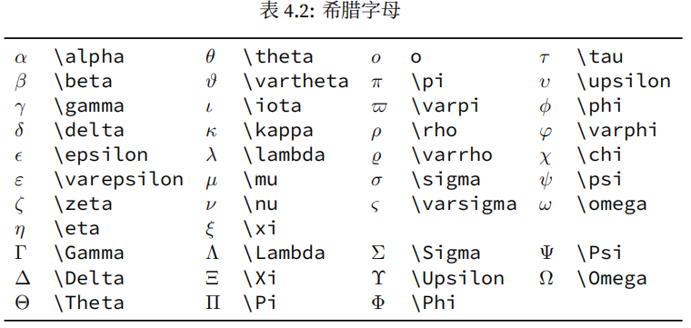

## 4.2.2 上下标和根号

指数或上标用 ^ 表示，下标用 _ 表示，根号用 \sqrt 表示。上下标如果多于一个字母或符号，需要用一对 {} 括起来。

```
\[ x_{ij}^2\quad \sqrt{x}\quad \sqrt[3]{x} \]
```

## 4.2.3 分数

一般分数用 \frac 命令表示；正文中用使用 `\dfrac`可以显得更大；独立公式中希望分数紧凑一点使用 \tfrac。

```
\frac{a}{b}
\dfrac{a}{b}
\tfrac{a}{b}
```

### 4.2.4 运算符

+、-、\*、/、=等可以直接输入，但是一些特殊的

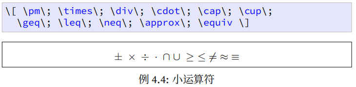

### 4.2.5 箭头

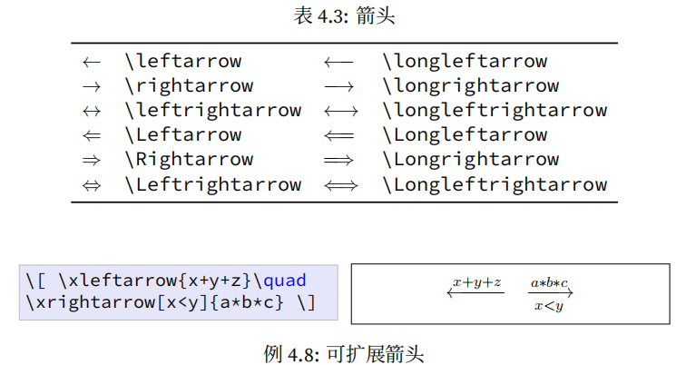

### 4.2.6 注音和标注

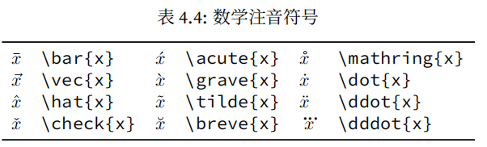

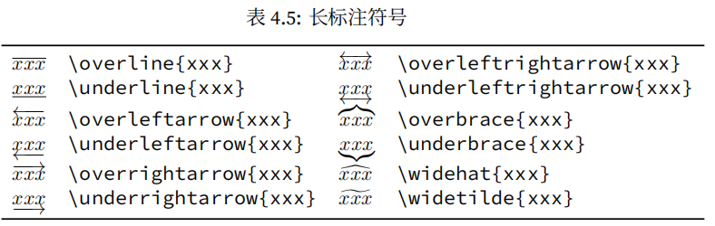

### 4.2.7 分隔符

各种括号用 ()  []  \{\}  \langle \rangle 等命令表示。因为\\|和|使用随意，引入**amsmath** 宏包用 **\lvert\rvert**和 **\lVert\rVert** 取而代之。可以在上述分隔符前面加 \big \Big \bigg \Bigg 等命令来调整其大小。

```
\usepackage{amsmath}
\[ \Bigg(\bigg(\Big(\big((x)\big)\Big)\bigg)\Bigg)\quad
\Bigg[\bigg[\Big[\big[[x]\big]\Big]\bigg]\Bigg]\quad
\Bigg\{\bigg\{\Big\{\big\{\{x\}\big\}\Big\}\bigg\}\Bigg\}
\]\[
\Bigg\langle\bigg\langle\Big\langle\big\langle\langle x
\rangle\big\rangle\Big\rangle\bigg\rangle\Bigg\rangle\quad
\Bigg\lvert\bigg\lvert\Big\lvert\big\lvert\lvert x
\rvert\big\rvert\Big\rvert\bigg\rvert\Bigg\rvert\quad
\Bigg\lVert\bigg\lVert\Big\lVert\big\lVert\lVert x
\rVert\big\rVert\Big\rVert\bigg\rVert\Bigg\rVert \]
```

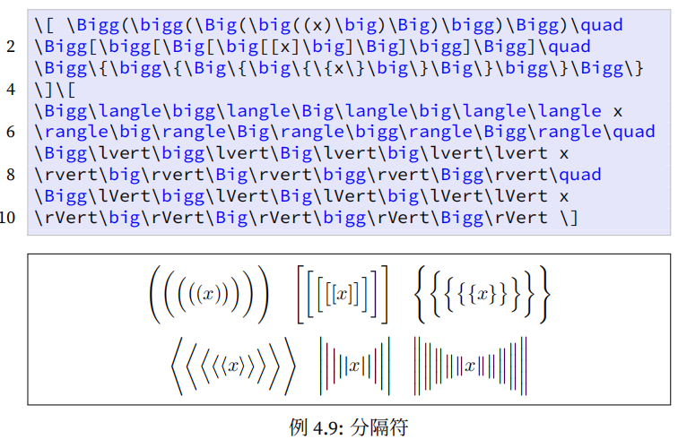

### 4.2.8 省略号

```
%独立公式
\[ x_1,x_2,\dots,x_n\quad 1,2,\cdots,n\quad
\vdots\quad \ddots \]
```


### 4.2.9 空白间距

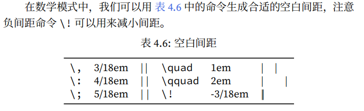

## 4.3 矩阵

公式编辑器

## 4.4 多行公式

### 4.4.1 长公式

分为无需对齐长公式和对齐长公式

```
%无对齐公式（自带公式编号\begin{equation}）
\begin{multline}
x = a+b+c+{} \\
d+e+f+g
\end{multline}
```

```
%对齐公式（公式编号需要引入\begin{equation}）
\[ \begin{split}
x ={} &a+b+c+{} \\
&d+e+f+g
\end{split} \]
```

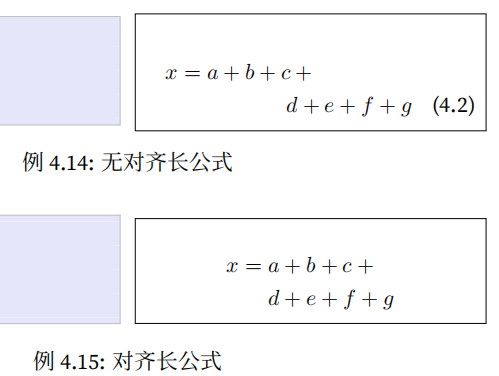

### 4.4.2 公式组

不需要对齐的公式组可以使用 **gather** 环境（见 例 4.16），需要对齐的公式组用 **align** 环境（见 例 4.17）。自带生成公式编号，如果需要取消在gather等后面加\*

```
%不需对齐公式组
\begin{gather}
a = b+c+d \\
x = y+z
\end{gather}
```

```
%对齐公式组
\begin{align}
a &= b+c+d \\
x &= y+z
\end{align}
```

### 4.4.3 分支公式

分段函数通常用 cases 次环境写成分支公式

```
\[ y=\begin{cases}
-x,\quad x\leq 0 \\
x,\quad x>0
\end{cases} \]
```

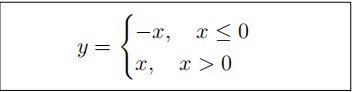

## 4.5 定理和证明

\newtheorem 命令可以用来定义定理之类的环境，其语法如下。

语法：{环境名}[编号延续]{显示名}[编号层次]

```
%定义环境
\newtheorem{definition}{定义}[section]
\newtheorem{theorem}{定理}[section]
\newtheorem{lemma}[theorem]{引理}
\newtheorem{corollary}[theorem]{推论}
```

然后可以使用环境：

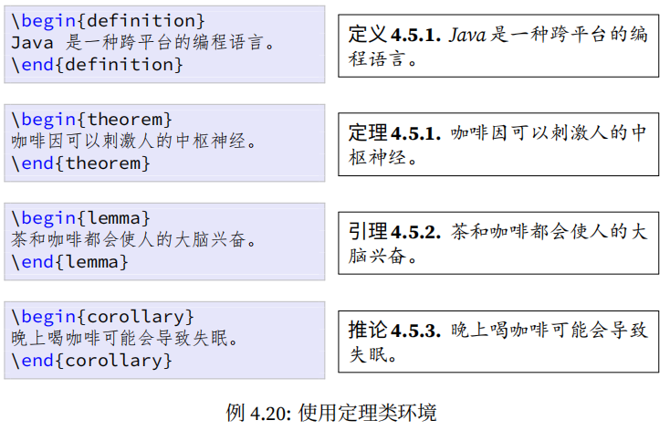

## 4.6 数学字体

\mathbb 和 \mathfrak 需要 amsfonts 宏包，\mathscr 需要mathrsfs 宏包。

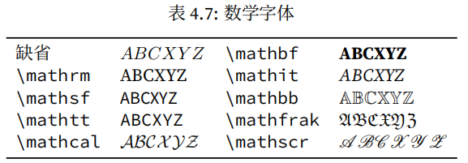

# 5 插图

## 5.1 图形预览

### 5.1.1 图形格式

LATEX 支持点阵图形格式 JPEG 和 PNG，也支持矢量格式 EPS 和 PDF 1。对于示意图，我们应该首选矢量格式；包含大量自然色彩的图像 (比如照片)应该选 JPEG；人工点阵图像应该选 PNG。

### 5.1.2 driver驱动

但 LaTeX 并不知道“怎么去读图像文件”，它需要一个“驱动程序 (driver)”来解析图片，这个 driver 取决于你用的 **编译方式**。

### 5.1.3 图形优化

- 使用 `xelatex` 或 `pdflatex`；

- eps清晰度最高但文件较大，图像尽量使用 `.pdf` （文件大小适中、清晰度也够用）或 `.png`；[JPG图片在线转换为PDF文件](https://www.ilovepdf.com/zh-cn/jpg_to_pdf)，[JPG到EPS转换器](https://www.freeconvert.com/zh/jpg-to-eps)，pdf转换后有空白，采用裁剪工具进行裁剪[pdf裁剪在线](https://pdfresizer.com/crop)

- 避免 `.jpg` 压缩后的模糊边缘。

### 5.1.4 图形转化和处理

## 5.2 插入图形

在正式开始下面的图片插入工作之前，需要注意以下几点：

（1）将要使用的图片文件放在tex文件的同一个文件夹下，确保可以直接查找到文件。

（2）图片命名中不要出现中文字符、不要空格和其他特殊符号，建议只用英文字母、下划线和简单符号。例如，本文中使用的两个图片文件名字分别为：“DV_demand.pdf”, "P+R_demand.pdf"。否则编译时容易出现“找不到文件”，或者其他奇怪的错误。

（3）上面提到的图片格式中：编译png, pdf, jpg用 pdfLaTex，编译eps 用XeLaTex。

（4）若图片格式不是以上四种，或者图片中空白边缘过多，可以用PS进行处理并转存为以上四种格式之一。

### 5.2.1 范围框

pdflatex和 xelatex 的用户可以跳过本小节，因为它们出现的比较晚，有机会了解这些图形格式。

### 5.2.2 基本命令

```
%加载图形宏包 graphicx
\usepackage{graphicx}
%插入图片并手动指定其边界框
\includegraphics[bb=0 0 300 200]{fig.png}
```

### 5.2.3 图形操作

\includegraphics 命令有一些参数选项可以用于缩放、旋转、裁剪等图形操作。

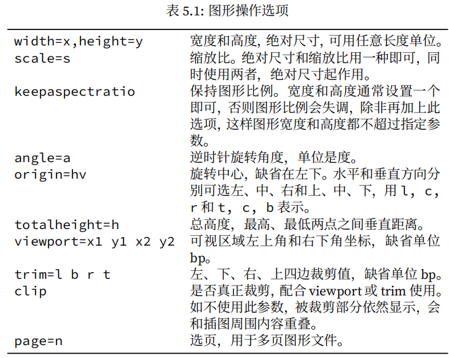

### 5.2.4 文件路径

没啥意义，少敲后缀

### 5.2.5 figure环境

插图通常需要占据大块空间，所以在文字处理软件中用户经常需要调整插图的位置。figure 环境可以自动完成这样的任务；这种自动调整位置的环境称作浮动环境 (float)。

**htbp** 选项用来指定插图的理想位置，这几个字母分别代表 **here**, **top**, **bottom**, **float page**，也就是就这里、页顶、页尾、浮动页 (专门放浮动环境的单独页面) 。**可以使用这几个字母的任意组合，一般不单独使用h**。

```
\begin{figure}[htbp]%图片竖直位置
\centering%居中
\includegraphics{myphoto.jpg}
\caption{有图有真相}%图注
\label{fig:myphoto}
\end{figure}
```

**公式、图、表的自定义编号：第一步按照标题层次编号，然后自定义编号的样式**

```
%公式自定义编号
\numberwithin{equation}{section} % 按 section 编号
\renewcommand{\theequation}{\thesection-\arabic{equation}}
%图自定义编号
\numberwithin{figure}{section} % 按 section 编号
\renewcommand{\thefigure}{\thesection-\arabic{figure}} % 自定义格式
%表自定义编号
\numberwithin{table}{section}
\renewcommand{\thetable}{\thesection-\arabic{table}}
```

调整编号类型，以表格为例子：labelformat控制标签（编号）显示的格式，default 是默认设置，它会使用标准的编号格式，通常会显示表格编号或图像编号后跟一个冒号，你可以根据需要将其设置为其他选项，如 parens（括号格式）等。`labelsep` 控制标签与标题文本之间的分隔符，其他常用的 `labelsep` 选项包括：`colon`插入冒号。`period`插入句号。`none不插入任何分隔符。

```
 \usepackage{caption}  % 需要添加这个宏包用于引用
 \captionsetup[table]{labelformat=default, labelsep=space}
```

### 5.2.6 多幅图形

#### 并排摆放，共享标题

使用两个 \includegraphics 命令

```
\begin{figure}[htbp]
2 \centering
\includegraphics{left.pdf}
4 \includegraphics{right.pdf}
\caption{反清复明}
6 \end{figure}
```

#### 并排摆放，各有标题

可以在 figure 环境中使用两个 minipage 环境，相当于figure环境下嵌套minipage~~~~

```
\begin{figure}[htbp]
\centering
\begin{minipage}{60pt}
\centering
\includegraphics{left.pdf}
\caption{清明}
\end{minipage}
\hspace{10pt}%在两个图形插入10pt间距；使用\hfill能自动分割
\begin{minipage}{60pt}
\centering
\includegraphics{right.pdf}
\caption{反复}
\end{minipage}
\end{figure}
```

出现问题：图注字数多会换行，这与minipage设置太小有关；图注不水平对齐，这与图片高度不同和 minipage 对齐基线的方式有关

```
%minipage用法
\begin{minipage}[<位置对齐>][<总高度>][<内部对齐>]{<宽度>}
  ...内容...
\end{minipage}
```

| 参数         | 是否可选 | 含义                                 | 说明                                                                                       |
| ---------- | ---- | ---------------------------------- | ---------------------------------------------------------------------------------------- |
| `[<位置对齐>]` | ✅ 可选 | 指明当前 `minipage` **相对于其他对象的垂直对齐方式** | 常用：`t`（top，上对齐）、`c`（center，居中对齐）、`b`（bottom，下对齐）                                         |
| `[<总高度>]`  | ✅ 可选 | 指定整个 `minipage` 的**总高度**           | 很少使用，除非需要精确对齐（例如固定高度的表格）                                                                 |
| `[<内部对齐>]` | ✅ 可选 | 控制 `minipage` 内部文本的基线位置            | 可用 `t`、`c`、`b`，但使用场景较少                                                                   |
| `{<宽度>}`   | ✅ 必填 | 该 `minipage` 的宽度                   | 可以用绝对单位（如 `60pt`, `3cm`），或相对单位（如 `0.45\textwidth（正文宽度*0.45）`, `\linewidth（当前环境的可用文字宽度）`） |

#### 并排摆放，共享标题，各有子标题

```
\usepackage{subcaption}

\begin{figure}[htbp]
\centering
\begin{subfigure}[t]{0.45\textwidth}
  \centering
  \includegraphics[width=\linewidth]{left.pdf}
  \caption{左脚清明}
  \label{fig:left}%加入引用标签
\end{subfigure}
\hfill
\begin{subfigure}[t]{0.45\textwidth}
  \centering
  \includegraphics[width=\linewidth]{right.pdf}
  \caption{右脚反复}
  \label{fig:right}
\end{subfigure}
\caption{反清复明（左右脚对比）}
\label{fig:overall}
\end{figure}
```

# 第6、7、8进行的是绘图讲解

# 9 表格

## 9.1 简单表格

tabular 环境提供了最简单的表格功能。它用 \hline 命令表示横线，| 表示竖线；用 & 来分列，用 \\ 来换行；每列可以采用居左、居中、居右等横向对齐方式，分别用 l, c, r 来表示。

```
\begin{tabular}{|l|c|r|}%这里表示三列，每列用|分开，l，c，r表示每列单元格的对齐方式
\hline
操作系统 & 发行版 & 编辑器 \\
\hline
Windows & MikTeX & TeXnicCenter \\
\hline
Unix/Linux & teTeX & Kile \\
\hline
macOS & MacTeX & TeXShop \\
\hline
跨平台 & TeX Live & TeXworks \\
\hline
\end{tabular}
```

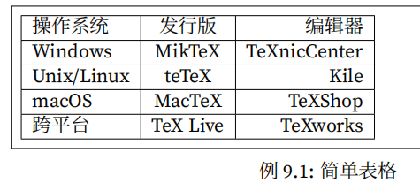

创建三线表：tabular 环境中的行可以采用居顶、居中、居底等纵向对齐方式，分别用 t, c, b 来表示，缺省的是居中对齐。列之间的分隔符也可以改用其他符号，比如用 || 来画双竖线（列与列之间的分割）。

t表示表格的**上边缘**会对齐到文字的**上方**。比如“文字1  [表格]  文字2”，表格可能比一行文字高（因为它有几行），这里设置的就是表格与外部文字的对齐方式

语法：[纵向对齐]{横向对齐和分隔符}。

\caption放在大环境内，表格环境外，然后放的位置在表格哪里最后表注就是在哪里。

```
\usepackage{booktabs}%引入宏包
\begin{table}[htbp]
\caption{操作系统}
\label{表哈哈哈}
\centering
\begin{tabular}{lll} %每列的对齐方式，左对齐
\toprule %三线表的上横线
操作系统 & 发行版 & 编辑器 \\
\midrule % 中横线
Windows & MikTeX & TexMakerX \\
Unix/Linux & teTeX & Kile \\
macOS & MacTeX & TeXShop \\
跨平台 & TeX Live & TeXworks \\
\bottomrule%最底横线
\end{tabular}
\end{table}
```

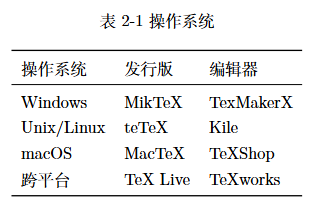

## 9.2 宽度控制

有时我们需要控制某列的宽度，可以将其对齐方式参数从 l, c, r 改为 p{宽度}。

```
\begin{tabular}{p{80pt}p{80pt}p{80pt}}
```

这时对齐方式缺省(默认左对齐),用前置命令\>{} 配合 \centering, \raggedleft 命令来把横向对齐方式改成居中或居右，`\arraybackslash` → 让 `\\` 不出错

```
\begin{tabular}{p{80pt}>{\centering}p{80pt}>{\raggedleft\arraybackslash}p{80pt}}
```

## 9.3 跨行跨列

语法：\multicolumn{横跨列数}{对齐方式}{内容}

语法：\cmidrule{起始列-结束列}

```
\usepackage{booktabs}
\begin{table}[htbp]
\centering
\begin{tabular}{lll}
\toprule
& \multicolumn{2}{c}{常用工具} \\ 
\cmidrule{2-3}
操作系统 & 发行版 & 编辑器 \\
\midrule
Windows & MikTeX & TexMakerX \\
Unix/Linux & teTeX & Kile \\
macOS & MacTeX & TeXShop \\
跨平台 & TeX Live & TeXworks \\
\bottomrule
\end{tabular}
\end{table}
```

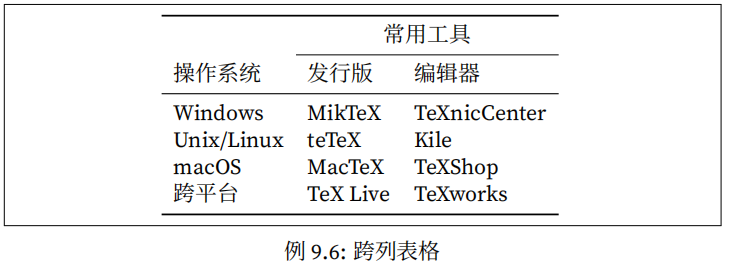

## 9.4 数字表格

语法：P{-m.n}其中 m 和 n 分别是小数点前后的位数，数字前负号可选

```
\usepackage{warpcol}

```

## 9.5 长表格

有时表格太长要跨页

## 9.6 宽表格

把表格方向换一下

## 9.7 彩色表格
