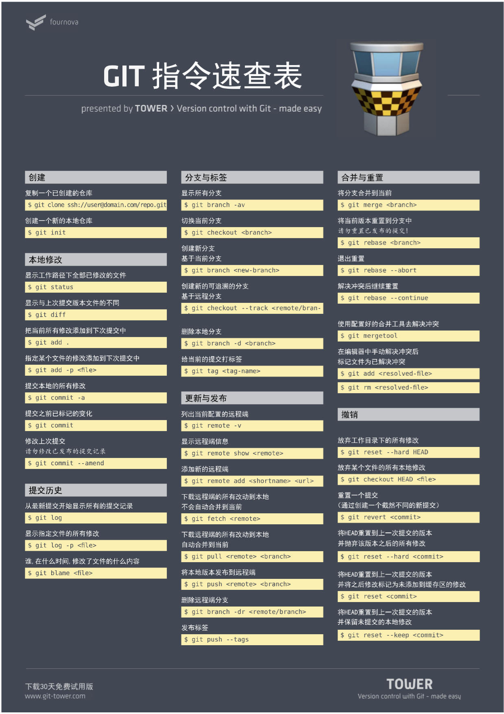
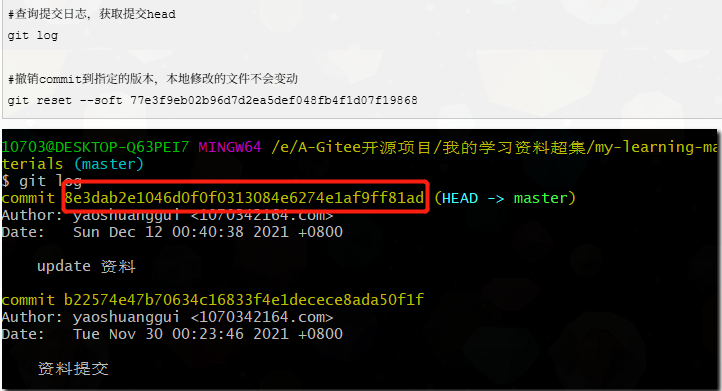

[docx转markdown](https://lwebapp.com/zh/docx-to-markdown)

# Git和Github的绑定

[参考文章](https://blog.csdn.net/black_sneak/article/details/139600633)

如果绑定过ssh，那么在用户下会有\.ssh文件夹。所以输入cd ~/\.ssh指令，如果未创建过就返回 "no such file or directory" 表明电脑没有ssh key，需要创建ssh key。

在终端输入 ssh\-keygen \-t rsa \-C “git账号”（账号是邮箱）。

连续进行 3 次回车Enter（确认）。

按路径进入 \.ssh，里面存储的是两个ssh key 的秘钥，id\_rsa\.pub 文件里面存储的是公钥，id\_rsa 文件里存储的是私钥，不能告诉别人。打开 id\_rsa\.pub 文件，复制里面的内容。登录github里面setting添加新的ssh\_key。

添加成功后回到bash输入：ssh \-T git@github\.com——输入yes成功后配置信息。

git config \-\-global user\.name “gitname”

git config \-\-global user\.email “git邮箱”

到此绑定成功。

# __新建仓库与github关联__

1. 在github上面新建仓库
2. git终端 cd “本地路径”
3. git init  \# 初始化本地 Git 仓库
4. 将远程 GitHub 仓库添加到本地仓库（URL链接）：git remote add origin https://github\.com/your\-username/your\-repository\.git
5. 推送过程：
- 暂存指令：git add 单个文件名（加引号）/\.（目录下所有文件）
- 提交指令：git commit \-m“失败信息”
- 提交指令：git push origin\(远程仓库定义名\) main\(分支\)

# 附加指令

测试ssh连接：ssh \-T git@github\.com

克隆仓库到本地：git clone 链接

__初始化仓库：git init     cd ”路径”→ →删除仓库：rm \-rf \.git__

仓库状态：git status

关联远程仓库：git remote add origin git@github\.com:huchao18/model\_learning\.git

查询远程仓库信息： git remote \-v

拉取仓库：git pull origin main

删除文件：[删除文件链接](https://liaoxuefeng.com/books/git/time-travel/delete/index.html)

## 问题描述1：当上传了超过100MB大文件后失败后，后面的上传一直失败。

## 解决方案：输入

```git
# 输入查询日志指令：按住⬇能查询以往日志，输入q退出
$ git log
# 找到想要提交日志序列ID
$ git reset 序列ID
```



| 命令                 | 做什么                           | 适合什么场景                 |
| ------------------ | ----------------------------- | ---------------------- |
| `git reset --soft` | 撤销提交，**保留修改**（在暂存区准备好重新提交）    | 想撤销提交但保留修改，并重新提交代码     |
| `git reset`（默认）    | 撤销提交，**取消暂存区修改**，但工作目录保留不变    | 想撤销提交并取消暂存的修改，但保留文件的内容 |
| `git reset --hard` | **彻底撤销所有修改**，包括提交、暂存区和工作目录的内容 | 想完全丢弃所有修改，恢复到某个提交的状态   |
