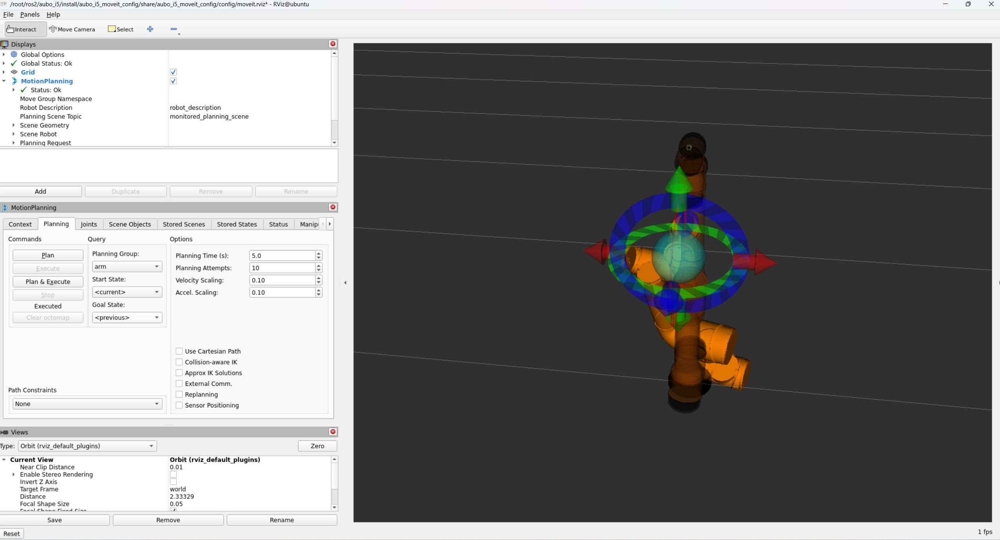

# 实验一：机械臂可视化

## ① 创建一个描述功能包：aubo_description。目录结构：

aubo_description/
├── launch/
│   └── display.launch.py
├── rviz/
│   └── aubo.rviz
├── urdf/
│   └── aubo_i5.urdf [下载地址](https://github.com/AuboRobot/aubo_robot/blob/master/aubo_description/urdf/aubo_i5.urdf)
├── meshes/ [下载地址](https://github.com/AuboRobot/aubo_robot/tree/master/aubo_description/meshes/aubo_i5)
│   ├── visual/
│   └── collision/

## ② 上传urdf文件

并且替换里面mesh的所有路径：

```textile
<mesh filename="package://aubo_description/meshes/visual/base_link.DAE" />
```

## ③display.launch.py内容：

```python
from launch import LaunchDescription                 # ROS2 启动系统的核心描述类
from launch_ros.actions import Node                  # 用于在 launch 中启动 ROS 节点
from launch.substitutions import Command              # 用于在 launch 时执行命令并获取输出
from launch.substitutions import FindExecutable      # 用于在 ROS2 环境中查找可执行程序（如 xacro）
from launch_ros.substitutions import FindPackageShare # 用于查找功能包的 share 目录
from launch.substitutions import PathJoinSubstitution # 用于在 launch 中安全拼接路径

def generate_launch_description():                   # ROS2 规定的入口函数，必须返回 LaunchDescription

    pkg_share = FindPackageShare('aubo_description')
    # 查找 aubo_i5_description 功能包的 share 目录（install 后也能用）

    urdf_file = PathJoinSubstitution([
        pkg_share,                                   # 功能包 share 路径
        'urdf',                                      # urdf 子目录
        'aubo_i5.urdf'                               # 具体 URDF / xacro 文件
    ])                                               # 生成 urdf 文件的完整路径

    robot_description = Command([
        FindExecutable(name='xacro'),                # 在系统中查找 xacro 可执行程序
        ' ',                                         # xacro 命令与参数之间的空格（必须）
        urdf_file                                   # 要解析的 urdf/xacro 文件路径
    ])                                               # 执行 xacro，生成 robot_description 字符串

    rviz_config = PathJoinSubstitution([
        pkg_share,                                   # 功能包 share 路径
        'rviz',                                      # rviz 配置文件目录
        'aubo.rviz'                                  # 已保存的 RViz 显示配置文件
    ])                                               # 生成 rviz 配置文件完整路径

    robot_state_publisher_node = Node(
        package='robot_state_publisher',             # 使用 robot_state_publisher 包
        executable='robot_state_publisher',          # 启动 robot_state_publisher 可执行程序
        name='robot_state_publisher',                # 节点名称
        parameters=[{                                # 节点参数列表
            'robot_description': robot_description   # 将 xacro 解析结果传给 robot_description 参数
        }]                                           # robot_state_publisher 通过它发布 TF
    )

    joint_state_publisher_gui_node = Node(
        package='joint_state_publisher_gui',         # 关节状态发布 GUI 包
        executable='joint_state_publisher_gui',      # 启动带滑块的关节发布器
        name='joint_state_publisher_gui'              # 节点名称
    )                                                 # 用于手动调试关节角度

    rviz_node = Node(
        package='rviz2',                             # RViz2 功能包
        executable='rviz2',                          # RViz2 可执行程序
        name='rviz2',                                # 节点名称
        arguments=['-d', rviz_config],               # 指定启动时加载的 RViz 配置文件
        output='screen'                              # 将 RViz 输出打印到终端
    )

    return LaunchDescription([
        robot_state_publisher_node,                  # 启动 TF 发布节点
        joint_state_publisher_gui_node,              # 启动关节滑块 GUI
        rviz_node                                    # 启动 RViz 并加载配置
    ])                                               # 返回完整的启动描述
```

## ④setup.py配置：

```python
from setuptools import setup
import os
from glob import glob

package_name = 'aubo_description'

setup(
    name=package_name,
    version='0.0.0',
    packages=[],
    data_files=[
        ('share/ament_index/resource_index/packages',
            ['resource/' + package_name]),
        ('share/' + package_name, ['package.xml']),

        # ↓↓↓ 这三行是关键 ↓↓↓
        (os.path.join('share', package_name, 'launch'), glob('launch/*.py')),
        (os.path.join('share', package_name, 'urdf'),   glob('urdf/*')),
        (os.path.join('share', package_name, 'meshes', 'visual'),
         glob('meshes/visual/**/*.*', recursive=True)),
        (os.path.join('share', package_name, 'meshes', 'collision'),
         glob('meshes/collision/**/*.*', recursive=True)),
    ],
    install_requires=['setuptools'],
    zip_safe=True,
    maintainer='your_name',
    maintainer_email='your@email.com',
    description='AUBO robot description package',
    license='Apache License 2.0',
)
```

## ⑤ 一键启动脚本

```bash
ros2 launch aubo_description display.launch.py
```

# 实验二 Moveit 设置助手机械臂配置[参考博文](https://blog.csdn.net/boboyaokuaile/article/details/148130676?fromshare=blogdetail&sharetype=blogdetail&sharerId=148130676&sharerefer=PC&sharesource=qq_54899044&sharefrom=from_link)

MoveIt 是 ROS 里用来“让机械臂动得对、动得安全、动得聪明”的软件框架。不直接控制电机，而是负责**怎么动**，其本质上是**算一组“关节随时间变化的轨迹”，让机器人从 A 到 B**

主要就是生成**SRDF文件**：告诉**机械臂怎么用**

**URDF文件**：机械臂**长什么样子**

**把 rviz-common 和 rviz2 升到 11.2.23（并确保相关 rviz 组件一起升级）**。

先安装moveit:

```bash
sudo apt install ros-humble-moveit
```

启动命令：

```bash
ros2 launch moveit_setup_assistant setup_assistant.launch.py
```

点击create new moveit configuration package 浏览选择上面的urdf文件→load files。

## 配置过程

## ① start Screen：新建还是加载一个 MoveIt 配置包

第一次就进行新建，找到对应的urdf文件，load files。加载正确右侧有机械臂，并且能拖动。

## ② Self-Collisions（自碰撞）

**作用**：**随机采样成千上万组关节角**，在每个姿态下检测所有 link 对，统计哪些 link 对：从未发生碰撞。将这些 link 对标记为：**“可以永久忽略的碰撞检测”**

步骤：`Generate Collision Matrix`→单击`Save`

## ③Virtual Joints（虚拟关节）

**作用**：告诉 MoveIt：**机器人“整体”固定在世界的哪里。**

设置列表→然后点击Save

| 项目                     | 正确填写            |
| ---------------------- | --------------- |
| Joint Name             | `virtual_joint` |
| Parent Frame（参考坐标系）    | `world`         |
| Child Link（URDF的根link） | `base_link`     |
| Joint Type（不是移动式）      | `fixed`（固定）     |

## ④Planning Groups（规划组）

作用：**告诉 MoveIt：哪些关节一起规划**（相当于提前规划哪些关节能动，哪些不能动）

### 1、Add Group（创建规划组）

命名规范

| 功能   | 推荐命名               |
| ---- | ------------------ |
| 主机械臂 | `arm`              |
| 夹爪   | `gripper`          |
| 组合   | `arm_with_gripper` |
| 底盘   | `base`             |

设置详解


单击Add Joints 将属于该组的关节添加到右侧→save

然后选取

| 定义方式          | 适用于什么      | 典型对象          | 推荐程度      |
| ------------- | ---------- | ------------- | --------- |
| **chain**     | 串联机械臂      | 6轴 / 7轴机械臂    | ⭐⭐⭐⭐⭐（首选） |
| **joints**    | 非标准机构 / 夹爪 | 夹爪、升降轴        | ⭐⭐⭐⭐      |
| **subgroups** | 组合控制       | arm + gripper | ⭐⭐⭐⭐      |
| **links**     | 特殊结构       | 非常规结构         | ⭐（谨慎）     |

最常见的机械臂就chain这个组

### 操作总结（针对一个标准机械臂）

如果你正在配置一个普通的机械臂，流程如下：

1. **Group Name**: 输入 `arm`。

2. **Kinematic Solver**: 下拉选择 `kdl_kinematics_plugin/KDLKinematicsPlugin`。

3. **Kin. Search Timeout**: 改为 `0.05`。

4. **点击 "Add Kin. Chain" 按钮**。

5. 在弹出的窗口中，Base Link 选机器人的底座，Tip Link 选法兰盘或末端执行器的安装点。

6. 点击 Save（保存）。

**接着配置夹爪（如果有）：**

1. **Group Name**: 输入 `gripper`。

2. **Kinematic Solver**: 选 `None`（夹爪通常不需要复杂的逆运动学求解，只需要开合）。

3. **点击 "Add Joints" 按钮**。

4. 勾选所有控制手指开合的关节。

5. 点击 Save。

## ⑤ Robot Poses（命名姿态）

作用：**保存常用关节姿态**

## ⑥ End Effectors（末端执行器）

作用：**把夹爪和机械臂逻辑关联起来**

有夹爪才配，没有就跳过

## ⑦Passive Joints（被动关节）

  99% 情况✅ **不配置**，只有在这些情况才用

- 弹簧关节

- 被动轮

- 纯随动结构

## ⑧ros2_control URDF Modifications

这是 MoveIt ↔ ros2_control ↔ 硬件/仿真 之间的“合同”。

| 界面区域                     | 选项 / 内容           | 应该如何配置                  | 原因 / 说明                 |
| ------------------------ | ----------------- | ----------------------- | ----------------------- |
| **Command Interfaces**   | position          | ✅ 勾选                    | MoveIt 默认发送“关节位置”指令，最稳定 |
|                          | velocity          | ❌ 不勾选                   | MoveIt 默认不用速度控制         |
|                          | effort            | ❌ 不勾选                   | 力矩控制，高级玩法               |
| **State Interfaces**     | position          | ✅ 勾选                    | MoveIt / RViz 需要读取关节角度  |
|                          | velocity          | ✅ 勾选                    | 状态反馈完整，轨迹显示正常           |
|                          | effort            | ❌ 不勾选                   | 做力控/阻抗才勾选               |
| **Add interfaces**       | 按钮                | ✅ 点一次                   | 生成 joint 接口 XML         |
| **生成的 joint 列表**         | joint name        | ✅ 必须与 URDF 完全一致         | 名字不一致 controller 不会工作   |
|                          | command_interface | `position`              | 与上方勾选一致                 |
|                          | state_interface   | `position` + `velocity` | MoveIt 需要               |
|                          | initial_value     | ✅ 建议保留                  | 防止仿真启动关节为 NaN           |
| **initial_positions 变量** | 是否需要              | ✅ 必须定义（xacro）           | 否则 xacro 展开报错           |
| **fixed joint**          | 是否加入              | ❌ 不要加入                  | ros2_control 只管可动关节     |
| **这页的作用**                | 自动修改 URDF         | ❌ 不会                    | 只生成片段                   |
| **你需要做的事**               | 复制 XML            | ✅ 必须手动粘贴                | 放入 `<ros2_control>` 中   |

## ⑨ ros2 Controllers

MoveIt 负责“规划”路径，而这里设置的 Controller 负责“执行”路径。

### 步骤 1：配置机械臂控制器 (Arm Controller)

这是最重要的一步，用于控制机械臂的主要运动。

1. **Controller Name（控制器名称）**:
   
   - 输入一个名字。通常约定俗成的标准命名是 **`arm_controller`** 或者 **`joint_trajectory_controller`**。
   
   - *注意：如果你是为了连接真实的机器人硬件，这个名字必须与你机器人驱动（driver）配置文件中定义的控制器名称完全一致。如果是做仿真，可以用 `arm_controller`。*

2. **Controller Type（控制器类型）**:
   
   - 保持默认选择 **`joint_trajectory_controller/JointTrajectoryController`**。
   
   - 这是绝大多数机械臂使用的标准控制器类型，它能接收一段轨迹（一系列的时间点和位置）并平滑执行。

3. **关联关节 (Add Components)**:
   
   - 点击 **`Add Planning Group Joints`** 按钮。
   
   - 在弹出的列表中，选择你之前定义的机械臂规划组（例如 `arm` 或 `manipulator`）。
   
   - 这样做会自动把属于机械臂的所有关节加入到这个控制器中。

4. **保存**:
   
   - 点击界面上的 **Save** 或 **Add Controller**（通常在点击添加关节后，界面下方会有确认按钮）。

---

### 步骤 2：配置夹爪控制器 (Gripper Controller) —— (如果有)

如果你的机器人有末端执行器（夹爪），建议单独为它配置一个控制器。

1. **再次点击 Create New Controller**。

2. **Controller Name**:
   
   - 输入 **`gripper_controller`** 或 `hand_controller`。

3. **Controller Type**:
   
   - 这里有两个选择，取决于你的夹爪类型：
     
     - **选项 A (最通用)**: 继续使用 **`joint_trajectory_controller/JointTrajectoryController`**。现在 MoveIt 2 对夹爪也常使用这种类型。
     
     - **选项 B (简单的开合)**: 有些简单的夹爪使用 `position_controllers/GripperActionController`，但在 Setup Assistant 的下拉菜单中可能不直接显示，通常选 `JointTrajectoryController` 是最稳妥的，因为 MoveIt 现在的 Simple Controller Manager 对它的支持最好。

4. **关联关节**:
   
   - 点击 **`Add Planning Group Joints`**。
   
   - 选择你的夹爪规划组（例如 `gripper` 或 `hand`）。

“Add Individual Joints” (添加单个关节) 的作用是让你手动、逐个地选择要分配给当前控制器的关节，而不是一次性添加整个组。用在：一个机械臂由两个控制器分管

## ⑩MoveIt Controllers

作用是告诉 MoveIt 规划器：“当你规划好一条路径后，应该把这条路径发给哪一个 ROS 2 控制器去执行？”

### 推荐操作步骤

1. **直接点击按钮：**
   
   - 点击界面左上方的 **“Auto Add FollowJointsTrajectory Controllers For Each Planning Group”**（自动为每个规划组添加轨迹跟随控制器）。
   
   - *解释：这是最快捷的方法，它会根据你的“规划组”自动生成对应的配置。*

2. **关键检查（非常重要）：**
   
   - 点击完按钮后，列表里会出现一行或多行配置。
   
   - 请务必检查 **“Controller”** 这一列的名字。
   
   - **规则：** 这里的名字必须和你**上一页（Setup ROS 2 Controllers）**里填写的 **Controller Name** 完全一致！
   
   - *例子：* 如果你在上一页填的是 `arm_controller`，但这里自动生成的是 `manipulator_controller`，你就需要修改它。

3. **如何修改（如果名字不一致）：**
   
   - 选中那一行。
   
   - 点击右下角的 **“Edit Selected”**。
   
   - 把 **Controller Name** 改成 `arm_controller`（或者你上一页填的那个名字）。
   
   - **Action Namespace** 通常保持默认的 `follow_joint_trajectory` 即可（这是 ROS 2 标准控制器的默认接口）。 

## Setup 3D Perception Sensors” (设置 3D 感知传感器)

这是告诉 MoveIt 你的机器人是否有“眼睛”（比如深度相机 Kinect, RealSense 或激光雷达）。如果有，MoveIt 会利用相机数据建立一个 Octomap（八叉树地图），让机器人能看到周围的障碍物并自动避开。

配置这个需要你知道相机的具体 ROS 话题（Topic）。没有选择None

## Launch Files (启动文件配置)

全部勾选

## Author Information

填写即可

## Configuration files

在工作空间下新建一个config文件夹，然后点击**Generate Package**

## 测试

colcon build → source install/setup.bash

测试运行

```bash
ros2 launch aubo_i5_moveit_config demo.launch.py
```

运行后



操作解释：

恭喜你！看到这个界面（RViz），说明你的 MoveIt 配置已经**完全成功**了，环境也已经跑起来了。

这个界面是 **RViz (ROS Visualization)**，现在的状态是加载了 **MoveIt Motion Planning** 插件的视图。

我们可以把它分为三个核心区域来理解：

---

### 1. 中间的 3D 视图区 (操作的核心)

这里显示的是你的 Aubo i5 机械臂模型。最显眼的是机械臂末端的那个**彩色球体和箭头**，这叫 **"Interactive Marker" (交互式标记)**。

- **功能：** 用来告诉机器人“我想让你去哪里”。

- **如何操作：**
  
  - **拖动箭头：** 让机械臂末端沿直线（X, Y, Z 轴）平移。
  
  - **拖动圆环：** 让机械臂末端进行旋转（调整姿态）。
  
  - **拖动中间的球：** 自由拖动位置。

- **原理：** 当你拖动这个球时，MoveIt 会在后台利用 **逆运动学 (IK)** 实时计算每一个关节应该转多少度才能到达你拖到的位置。如果球变红或者拖不动，说明超出了机器人的工作空间（够不着）。

---

### 2. 左下角的 "MotionPlanning" 面板 (控制台)

这是你给机器人下达指令的地方。注意看你现在的 **Planning** 标签页：

- **Query (查询设置):**
  
  - **Planning Group:** `arm`。这是你在配置助手里设置的规划组名称。
  
  - **Start State:** `<current>`。表示从机器人当前的位置开始规划。
  
  - **Goal State:** `<current>`。这里通常不用手动选，当你拖动 3D 视图里的彩色球时，这里会自动变成“目标位置”。

- **Commands (命令按钮 - 最重要):**
  
  - **Plan (规划):** 点击它，计算机只会**算**一条路径。你会看到屏幕上出现一条半透明的“影子”或者轨迹，演示机器人打算怎么走。**此时机器人实体不会动。**
  
  - **Execute (执行):** 只有点击它，机器人实体才会真正沿着刚才算好的路径移动。
  
  - **Plan & Execute:** 懒人按钮，算好路径直接开始跑。
  
  - **Stop:** 紧急停止。

- **Options (选项):**
  
  - **Velocity / Accel Scaling (0.10):** 速度和加速度比例。现在默认是 `0.1` (10%)。这意味着机器人在模拟中会动得很慢。**新手建议保持低速**，观察清楚轨迹。

---

### 3. 左上角的 "Displays" 面板 (显示图层)

这里类似 Photoshop 的图层管理。

- **Grid:** 地面上的网格。

- **MotionPlanning:** MoveIt 的核心显示插件。如果取消勾选，那个控制球和面板都会消失。

- **RobotDescription:** 显示机器人的 3D 模型。

---

### 动手试一试 (Next Step)

请按照以下步骤体验第一次运动规划：

1. 在 3D 视图中，用鼠标**按住**那个彩色的箭头或圆环，把机械臂的头拖到一个新的位置（不要拖太远）。

2. 看左下角，点击 **"Plan"** 按钮。
   
   - *观察：* 应该会看到一个虚影在演示移动。

3. 如果虚影的路径看起来没问题（没有撞到自己），点击 **"Execute"** 按钮。
   
   - *观察：* 橙色的实体机械臂应该会慢慢移动到目标位置。

如果你能完成这三步，你的仿真环境就彻底通了！接下来就可以把这个逻辑应用到真实的 Aubo 机械臂上了。


# 实验三 机械臂Rviz和Gazebo仿真

## Moveit！与Gazebo联合仿真

- **MoveIt! (大脑)：** 负责计算运动轨迹（怎么走不撞墙、怎么避障）。它通常在 **Rviz** 中运行和显示。

- **Gazebo (身体)：** 负责模拟物理环境（重力、碰撞、惯性）。它代表了“真实的机器人”。

- **桥梁 (Bridge)：** 这里的核心思路是搭建一座桥。
  
  - 你需要配置两头的 YAML 参数文件。
  
  - 最后达到的效果是：你在 MoveIt (Rviz) 里拖动机械臂规划路径，Gazebo 里的机械臂就会跟着动起来。

**MoveIt! (做规划)** $\rightarrow$ **ros_control (算控制量)** $\rightarrow$ **Gazebo/真机 (执行动作)**。


# 第一件事情，修改urdf文件

主要修改了速度velocity=2和力矩effort=150用于Gazebo仿真

```xml

<?xml version="1.0"?>
<robot  name="aubo_i5">

  <link name="base_link">
    <inertial>
      <origin xyz="-1.4795E-13 0.0015384 0.020951" rpy="0 0 0" />
      <mass value="0.83419" />
      <inertia ixx="0.0014414" ixy="7.8809E-15" ixz="8.5328E-16" iyy="0.0013542" iyz="-1.4364E-05" izz="0.0024659" />
    </inertial>
    <visual>
      <origin xyz="0 0 0" rpy="0 0 0" />
      <geometry>
        <mesh filename="package://aubo_description/meshes/visual/base_link.DAE" />
      </geometry>
      <material name="">
        <color rgba="1 1 1 1" />
      </material>
    </visual>
    <collision>
      <origin xyz="0 0 0" rpy="0 0 0" />
      <geometry>
        <mesh filename="package://aubo_description/meshes/collision/base_link.STL" />
      </geometry>
    </collision>
  </link>

  <link name="shoulder_Link">
    <inertial>
      <origin xyz="3.2508868974735E-07 0.00534955349296065 -0.00883689325611056" rpy="0 0 0" />
      <mass value="1.57658348693929" />
      <inertia ixx="0.0040640448663128" ixy="0" ixz="0" iyy="0.00392863238466817" iyz="-0.000160151642851425" izz="0.0030869857349184" />
    </inertial>
    <visual>
      <origin xyz="0 0 0" rpy="0 0 0" />
      <geometry>
        <mesh filename="package://aubo_description/meshes/visual/shoulder_Link.DAE" />
      </geometry>
      <material name="">
        <color rgba="1 1 1 1" />
      </material>
    </visual>
    <collision>
      <origin xyz="0 0 0" rpy="0 0 0" />
      <geometry>
        <mesh filename="package://aubo_description/meshes/collision/shoulder_Link.STL" />
      </geometry>
    </collision>
  </link>

  <joint name="shoulder_joint" type="revolute">
    <origin xyz="0 0 0.122" rpy="0 0 3.1416" />
    <parent link="base_link" />
    <child link="shoulder_Link" />
    <axis xyz="0 0 1" />
    <limit lower="-3.05" upper="3.05" effort="150" velocity="2" />
  </joint>

  <link name="upperArm_Link">
    <inertial>
      <origin xyz="0.203996646979614 2.01304585036544E-10 0.0127641545395984" rpy="0 0 0" />
      <mass value="4.04175782265494" />
      <inertia ixx="0.00965399211106204" ixy="0" ixz="0" iyy="0.144993869035655" iyz="0" izz="0.142607184038966" />
    </inertial>
    <visual>
      <origin xyz="0 0 0" rpy="0 0 0" />
      <geometry>
        <mesh filename="package://aubo_description/meshes/visual/upperArm_Link.DAE" />
      </geometry>
      <material name="">
        <color rgba="1 1 1 1" />
      </material>
    </visual>
    <collision>
      <origin xyz="0 0 0" rpy="0 0 0" />
      <geometry>
        <mesh filename="package://aubo_description/meshes/collision/upperArm_Link.STL" />
      </geometry>
    </collision>
  </link>

  <joint name="upperArm_joint" type="revolute">
    <origin xyz="0 0.1215 0" rpy="-1.5708 -1.5708 0" />
    <parent link="shoulder_Link" />
    <child link="upperArm_Link" />
    <axis xyz="0 0 1" />
    <limit lower="-3.05" upper="3.05" effort="150" velocity="2" />
  </joint>

  <link name="foreArm_Link">
    <inertial>
      <origin xyz="0.188922115560337 6.78882434739072E-07 0.0981026740461557" rpy="0 0 0" />
      <mass  value="2.27145669098343" />
      <inertia ixx="0.00214322284946289" ixy="0" ixz="-0.00073120631553383" iyy="0.0443926090878205" iyz="0" izz="0.0441273797128365" />
    </inertial>
    <visual>
      <origin xyz="0 0 0" rpy="0 0 0" />
      <geometry>
        <mesh filename="package://aubo_description/meshes/visual/foreArm_Link.DAE" />
      </geometry>
      <material name="">
        <color rgba="1 1 1 1" />
      </material>
    </visual>
    <collision>
      <origin xyz="0 0 0" rpy="0 0 0" />
      <geometry>
        <mesh filename="package://aubo_description/meshes/collision/foreArm_Link.STL" />
      </geometry>
    </collision>
  </link>

  <joint name="foreArm_joint" type="revolute">
    <origin xyz="0.408 0 0" rpy="-3.1416 -5.1632E-18 -5.459E-16" />
    <parent link="upperArm_Link" />
    <child link="foreArm_Link" />
    <axis xyz="0 0 1" />
    <limit lower="-3.05" upper="3.05" effort="150" velocity="2" />
  </joint>

  <link name="wrist1_Link">
    <inertial>
      <origin xyz="7.54205137428592E-07 0.0062481254331257 -0.00392367464072373" rpy="0 0 0" />
      <mass value="0.500477539188764" />
      <inertia ixx="0.00071194605962081" ixy="0" ixz="0" iyy="0.00040588242872958" iyz="-2.30808694377512E-05" izz="0.000685574004861334" />
    </inertial>
    <visual>
      <origin xyz="0 0 0" rpy="0 0 0" />
      <geometry>
        <mesh filename="package://aubo_description/meshes/visual/wrist1_Link.DAE" />
      </geometry>
      <material name="">
        <color rgba="1 1 1 1" />
      </material>
    </visual>
    <collision>
      <origin xyz="0 0 0" rpy="0 0 0" />
      <geometry>
        <mesh filename="package://aubo_description/meshes/collision/wrist1_Link.STL" />
      </geometry>
    </collision>
  </link>

  <joint name="wrist1_joint" type="revolute">
    <origin xyz="0.376 0 0" rpy="3.1416 -1.8323E-15 1.5708" />
    <parent link="foreArm_Link" />
    <child link="wrist1_Link" />
    <axis xyz="0 0 1" />
    <limit lower="-3.05" upper="3.05" effort="150" velocity="2" />
  </joint>

  <link name="wrist2_Link">
    <inertial>
      <origin xyz="-7.54207620578635E-07 -0.00624812542617262 -0.00392367464115684" rpy="0 0 0" />
      <mass value="0.500477539245988" />
      <inertia ixx="0.00071194605981829" ixy="0" ixz="0" iyy="0.000405882428755442" iyz="2.30808694515886E-05" izz="0.000685574005112107" />
    </inertial>
    <visual>
      <origin xyz="0 0 0" rpy="0 0 0" />
      <geometry>
        <mesh filename="package://aubo_description/meshes/visual/wrist2_Link.DAE" />
      </geometry>
      <material name="">
        <color rgba="1 1 1 1" />
      </material>
    </visual>
    <collision>
      <origin xyz="0 0 0" rpy="0 0 0" />
      <geometry>
        <mesh filename="package://aubo_description/meshes/collision/wrist2_Link.STL" />
      </geometry>
    </collision>
  </link>

  <joint name="wrist2_joint" type="revolute">
    <origin xyz="0 0.1025 0" rpy="-1.5708 -1.8709E-15 -1.6653E-16" />
    <parent link="wrist1_Link" />
    <child link="wrist2_Link" />
    <axis xyz="0 0 1" />
    <limit lower="-3.05" upper="3.05" effort="150" velocity="2" />
  </joint>

  <link name="wrist3_Link">
    <inertial>
      <origin xyz="3.92048778449938E-10 0.000175788057281467 -0.0213294490706684" rpy="0 0 0" />
      <mass value="0.158309554874285" />
      <inertia ixx="7.31376196034769E-05" ixy="0" ixz="0" iyy="7.19528188876563E-05" iyz="0" izz="0.000108772439051422" />
    </inertial>
    <visual>
      <origin xyz="0 0 0" rpy="0 0 0" />
      <geometry>
        <mesh filename="package://aubo_description/meshes/visual/wrist3_Link.DAE" />
      </geometry>
      <material name="">
        <color rgba="1 1 1 1" />
      </material>
    </visual>
    <collision>
      <origin xyz="0 0 0" rpy="0 0 0" />
      <geometry>
        <mesh filename="package://aubo_description/meshes/collision/wrist3_Link.STL" />
      </geometry>
    </collision>
  </link>

  <joint name="wrist3_joint" type="revolute">
    <origin xyz="0 -0.094 0" rpy="1.5708 0 1.7907E-15" />
    <parent link="wrist2_Link" />
    <child link="wrist3_Link" />
    <axis xyz="0 0 1" />
    <limit lower="-3.05" upper="3.05" effort="150" velocity="2" />
  </joint>

  <link name="world" />

  <joint name="world_joint" type="fixed">
    <parent link="world" />
    <child link = "base_link" />
    <origin xyz="0.0 0.0 0.0" rpy="0.0 0.0 0.0" />
  </joint>
</robot>


```

为什么**选用xacro**：

| 项目               | URDF   | Xacro              |
| ---------------- | ------ | ------------------ |
| 本质               | 静态 XML | **带参数和宏的 URDF 模板** |
| 参数化              | ❌ 不能   | ✅ 可以               |
| 代码复用             | ❌ 不能   | ✅ 宏（macro）         |
| 条件判断             | ❌ 不能   | ✅ if / unless      |
| 维护复杂模型           | ❌ 非常痛苦 | ✅ 工程可维护            |
| MoveIt / ROS2 使用 | 可用     | **推荐**             |

复杂模型维护优点：每个功能部件一个 xacro（相机 / 夹爪 / 机械臂 / 底盘），  最后用一个“总 xacro”把它们通过 joint 拼成一台完整机器人。
