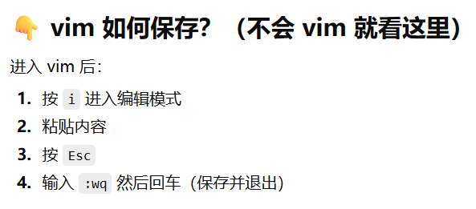
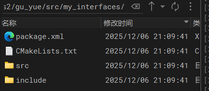

# ros教程

## 事前准备

[Jetson Orin NX 亚博教程](https://www.yahboom.com/study/Orin-NX-SUPER)  提取码：**ntgy** （可进行整体参考）

为了环境的隔离和便捷：拟采用docker进行ros整体拉取

# 电脑远程连接jetson

**用户名**：xavier   **密码**：123456

查询jetson的ip：

```bash
ifconfig
```

找到输出inet下面的（最后一段）：192.168.xxxx

这里采用windterm远程ssh连接

查询jetson版本：

```bash
lsb_release -a
```

该系统版本：Ubuntu 20.04 LTS（Focal Fossa）

# docker指令

[ROS镜像版本](https://github.com/sloretz/ros_oci_images?utm_source=chatgpt.com)

查询docker安装版本：

```bash
docker --version
```

查看是否在运行：

```bash
systemctl status docker
```

查看现有（所有包括停止）容器（去掉-a就是查询运行的容器）

```bash
#查看所有包括停止
sudo docker ps -a
#查看运行
sudo docker ps 
```

查看镜像:

```bash
sudo docker images
```

删除单个镜像（如果镜像被容器占用就要先删掉容器）

```bash
docker rmi <IMAGE_ID>
```

删除容器：

```bash
#删除停止的容器
sudo docker rm <CONTAINER_ID>

#强制删除容器
sudo docker rm -f <CONTAINER_ID>
```

启动容器：（不能用这个方式开启两个容器）

```bash
#ai后面容器名(带输入、输出并进入容器)
sudo docker start -ai ros2
```

进入**运行中容器**（伪终端）：

```bash
sudo docker exec -it <container> bash
```

停止容器：

```bash
sudo docker stop ros2
```

退出容器：

```bash
exit
```

# 新建容器

运行宿主机允许容器访问 X11           

```bash
xhost +local:docker
```

新建容器：(windterm中逐行发送)

```bash
sudo docker run -it \
  --name ros2 \                 # 容器名称：ros2（方便后续 start/stop）
  --env DISPLAY=$DISPLAY \      # 把宿主机的 DISPLAY 环境变量传入容器，用于 X11 图形界面显示
  --env QT_X11_NO_MITSHM=1 \    # 解决 Qt 应用与 X11 共享内存冲突的问题（常用于 ROS、RViz）
  -v /tmp/.X11-unix:/tmp/.X11-unix \  # 把宿主机的 X11 socket 挂载进去，让容器能访问 X server
  -v /home/xavier/hsc/ros2/:/root/ros2 \  # 挂载宿主机目录到容器 /root/ros2（共享代码、数据）
  --net=host \                  # 让容器使用宿主机网络（ROS 多节点通信推荐使用）
  ghcr.io/sloretz/ros:humble-desktop \   # 使用 ROS2 Humble 桌面版镜像
  bash                          # 启动容器后直接进入 bash 终端
```

提交现有容器为新镜像：

```bash
 sudo docker commit ros2 ros2_backup  #现在容器名 新镜像名字
```

映射摄像机进入容器：反斜杠后面不能有空格

```bash
sudo docker run -it \
  --name ros2 \
  --env DISPLAY=$DISPLAY \
  --env QT_X11_NO_MITSHM=1 \
  -v /tmp/.X11-unix:/tmp/.X11-unix \
  -v /home/xavier/hsc/ros2/:/root/ros2 \
  --net=host \
  --privileged \
  --device /dev/bus/usb:/dev/bus/usb \
  --device-cgroup-rule='c 81:* rmw' \
  ros2_backup \
  bash
```

# 代理

能行指令：[Clash在Linux下的使用 | 云端笔记](https://leux.net/doc/Clash%E5%9C%A8Linux%E4%B8%8B%E7%9A%84%E4%BD%BF%E7%94%A8.html)

~~订阅链接：+链接（要加引号）——遇到失败重新订阅一下~~  在alias加入更新订阅链接和重命名mh，运行mh自动更新。

```bash
wget -O /home/xavier/mihomo/config.yaml 
```

运行代理：~~sudo /usr/local/bin/clash -d /home/xavier/mihomo/~~

输入上面命令太长：建立alias——更改`.bashrc` 配置文件（会在每次你打开一个 **新的终端** 时自动执行，用于：配置环境变量、设置别名、自动加载某些软件环境）。

**打开vim编辑器：vim ~/.bashrc→按i进入编辑模式，在最后一行输入：alias mh="sudo /usr/local/bin/clash -d /home/xavier/mihomo/"→按esc+“：wq”退出→让新命令生效：source ~/.bashrc。** 后面的命令同样简化！！！

简单运行：

```bash
mh
```

查看进程：

```bash
ps aux | grep mihomo
```

```bash
ps aux | grep 7890
```

终止进行：**Ctr+C**

```bash
kill PID
```

## [Ubuntu通过docker部署Chatgpt](https://wongsaang.github.io/chatgpt-ui/zh/guide/quick-start.html) 要api key

# windows远程显示

xhost +local:docker（运行容器使用主机）+打开容器→设置display环境变量

## windterm远程连接+图形化

<u>注意，在打开容器的时候，有时windterm输入xavier密码后卡住，ctr+c强制退出就可</u>

windterm远程连接[WindTerm - X11 转发](https://kingtoolbox.github.io/2020/07/21/x11_forwarding/?utm_source=chatgpt.com#X11-Forwarding)

1️⃣ Windows下载启动 VcXsrv 
2️⃣ WindTerm：开启 X11 Forwarding（外部显示）  
3️⃣ WindTerm SSH 登录到 Jetson  
4️⃣ WindTerm 里执行：

```bash
#测试wind输出localhost:10.0
echo $DISPLAY
#成功后会有一个小眼睛
xeyes
```

windows进行放行（设置display环境变量）。查询windows（终端）——ipconfigs——ipv4:192.168.31.163，windterm设置ipv4+端口0（一般）

```bash
export DISPLAY=192.168.31.163:0 #后面的ip根据查询填
```

xhost + 输出access control disabled, clients can connect from any host成功，然后进行配置宿主机允许容器访问x11

```bash
xhost +local:docker
```

新建容器，然后进入测试X11在容器里面是否成功

```bash
apt update
apt install -y x11-apps
xeyes
```

有眼睛在动就行（哈哈哈哈哈）

**加载 ROS2 的环境变量**，让当前 shell 能识别 ROS2 的命令和库。（当出现“<mark>bash: ros2: command not found</mark>”）⬇

```bash
source /opt/ros/humble/setup.bash
```

一个终端打开容器（sudo docker start -ai 容器名）测试小海龟：（但是不能通过键盘来移动小海龟）

```bash
ros2 run turtlesim turtlesim_node #打开界面
```

另一个终端打开容器（~~sudo docker exec -it ros2 bash~~  简化为**<mark>ros2exec</mark>**并自动加载环境变量），~~要先**加载ros2环境变量**~~，方向键控制小海龟：（注意操作，让小海龟界面保持在最上面，然后输入下面该指令，鼠标要在下面这个界面）

```bash
ros2 run turtlesim turtle_teleop_key
```

另一个终端打开容器（~~sudo docker exec -it 容器名 bash~~），~~同样加载ros2环境变量~~，设置一下display接口，运行rqt就能获取系统的最新节点关系。

```bash
rqt
```

小海龟就是通过四大通信机制中的话题通信连接，键盘是话题的发布者，海龟节点就是话题的订阅者。

## 采用VNC（也是靠VcXsrv转发显示）——优点是能显示jetson那边的界面

```
VNC连接就是设置好远程连接的ip，通过ifconfig查询ip，然后加上“：端口号”（默认下面的5901和5900，可以进行设置）
```

[VNC Viewer安装教程（保姆级安装）-CSDN博客](https://blog.csdn.net/yushaoyyds/article/details/133926519)

jetson安装VNC

```bash
sudo apt install -y tigervnc-standalone-server tigervnc-common
```

验证是否安装成功——输出/usr/bin/vncserver

```bash
which vncserver
```

是否能设置密码：would like....——选择n

```bash
vncpasswd
```

安装XFCE桌面来支持VNC：——安装过程光标选择“lightdm”再enter

```bash
sudo apt install xfce4 xfce4-goodies -y
```

生成 xstartup（每个用户一次）：

```bash
vncserver -kill :1
rm -rf ~/.vnc/xstartup
```

创建新的 xstartup:（vim编辑器）



```bash
vim ~/.vnc/xstartup
```

赋予可执行权限

```bash
chmod +x ~/.vnc/xstartup
```

启动：

```bash
vncserver :1 -geometry 1920x1080 -depth 24
```

停止：

```bash
vncserver -kill :1
```

确认VNC监听端口对不对：

```bash
sudo netstat -tlnp | grep 5901
```

正确输出：tcp        0      0 0.0.0.0:5901      0.0.0.0:*      LISTEN      <pid>/Xtigervnc

发现监听端口不对：

```bash
vim ~/.vnc/config
```

写入内容:localhost=0

## 强制启动：（以上指令已经配好）

```bash
vncserver :1 -geometry 1920x1080 -depth 24 -localhost no
```

# 强制 VNC 显示 Jetson 本机桌面（这个只是复制jetson桌面）

```bash
sudo apt-get install x11vnc -y #安装
```

```bash
x11vnc -storepasswd #设置密码
```

```bash
x11vnc -display :0 -usepw #共享真实桌面5900
```

# 问题——主要是display显示环境变量的问题，进入容器测试默认为空，进行设置

首先测试环境变量问题：

```bash
echo $DISPLAY
```

DISPLAY环境变量问题导致显示的问题：

在 Linux（X11 系统）中，**所有 GUI 程序都必须通过 DISPLAY 才能知道在哪里显示窗口**。

例如：

| DISPLAY 值        | 含义             |
| ---------------- | -------------- |
| `:0`             | 本地物理显示器（你的桌面）  |
| `:1`             | 另一个本地 X 会话     |
| `localhost:10.0` | SSH 转发的远程显示    |
| 空的（没有值）          | GUI 完全无法显示，会报错 |

设置环境变量问题：

```bash
export DISPLAY=:0
```

```bash
export DISPLAY=localhost:10.0#ssh自动寻找
```

# ros

## 本质：用于快速搭建机器人的软件库（核心是通信）和工具集

若要编辑python代码，可在任意终端中（容器里面没有）输入“**code**”打开编辑器进行编辑。

进入容器（打开ros2）

## 第一部分 安装ros2→运行小海龟

查询ros版本：

```bash
printenv | grep ROS
```

ros查看环境变量：

```bash
echo $ROS_DISTRO
```

之前运行的小海龟就是读取“AMENT_PREFIX_PATH”环境变量的值，然后找到该环境变量下的lib目录查找相关功能包和可执行文件。

## 第二部分 基础入门——生成第一个节点

#### 小海龟就是通过节点之间订阅和发布运行的，节点还可以使用服务、配置参数、执行动作等。

已经将本书的代码上传到挂载的/hsc文件夹，进入容器的root代表的就是/hsc文件夹，后面进入某个文件夹只需要**cd +root/相对路径**，例如：

```bash
root@ubuntu:~# cd root/ros2/书代码/chapt2/
```

创建节点示例（已在chapt2下面的**ros2_python_node.py**）：

```bash
import rclpy                   # 导入 ROS2 的 Python 客户端库
from rclpy.node import Node    # 从 rclpy 中导入 Node 类，用于创建节点

def main():
    rclpy.init()               # 初始化 ROS2，必须的启动步骤
    node = Node("python_node") # 创建一个名为 "python_node" 的节点对象
    node.get_logger().info('你好 Python 节点！');  # 输出日志信息到屏幕
    rclpy.spin(node)           # 让节点保持运行（等待接收消息或执行回调）
    rclpy.shutdown()           # 程序退出后关闭 ROS2

if __name__=="__main__":       # 如果当前文件被直接运行（而不是被导入）
    main()                     # 执行 main() 函数
```

运行上述代码：

```bash
python3 ros2_python_node.py
```

打开另一个容器（ros2exec）：ros2 node list就能查询到节点列表

## 第三部分 订阅与发布

## 3.1 话题通信介绍

ROS话题机制四大核心：**发布者、订阅者、话题名称、话题类型**。

打开小海龟模拟器（上面有介绍）→在另一个终端打开容器查看节点信息：

```bash
ros2 node info /turtlesim
```

返回的各部分：① Subscribers（订阅者）、② Publishers（发布者）、③ Service Servers（服务端）、④ Action Servers（动作服务器）

解释各部分功能:我要发布一个**话题**（话题是**实时、连续的数据流**），所以像位置、速度就用话题；**服务**（一次请求，一次响应），就用于创建新乌龟、清除轨迹等；**动作**（长时间、可取消、有反馈的任务）

控制小海龟速度：（angular中小海龟只能绕z轴旋转）

```bash
ros2 topic pub -r 10 /turtle1/cmd_vel geometry_msgs/msg/Twist "{linear: {x: 2.0, y: 0.0, z: 0.0}, angular: {x: 0.0, y: 0.0, z: 2.0}}"
```

解释： `ros2 topic` ：操作话题的子命令；`-r 10`：10Hz发送频率；`pub`：发布；`/turtle1/cmd_vel`：这个话题是 turtlesim 用来接收 **速度控制指令** 的订阅端口；geometry_msgs/msg/Twist：发布的数据类型。

## 3.2 Python进行话题的订阅和发布

### 3.2.1 通过话题发布小说

首先建立语言代码包：

```bash
ros2 pkg create demo_python_topic --build-type ament_python --dependencies rclpy example_interfaces --license Apache-2.0
```

问题，发现文件只是可读，是用户的原因（路径下的文件夹及其子文件夹都加入到xavier权限下），在任何一个终端运行：

```bash
sudo chown -R xavier:xavier /home/xavier/hsc/ros2
```

生成的目录结构：只有写代码的目录和setup.py配置需要管，其他不用管

```arduino
demo_python_topic/
├── demo_python_topic/          ← ① Python 代码目录（你写节点的地方）#这个需要写
│   ├── __init__.py             ← ② 让目录变成 Python 包（必须有）
│
├── package.xml                 ← ③ ROS2 包配置文件（依赖、许可证、包名）
├── setup.py                    ← ④ Python 安装脚本（入口点在这里配置） #写好代码在这儿配置节点，其他文件不用管
├── setup.cfg                   ← ⑤ 安装路径配置文件
│
├── resource/
│   └── demo_python_topic       ← ⑥ ROS2 要求的包资源标识文件
│
└── test/
    ├── test_copyright.py       ← ⑦ 自动生成的 License 测试
    └── test_flake8.py          ← ⑧ 自动生成的代码格式测试
```

setsp代码解释：

```python
from setuptools import find_packages, setup   # 导入构建工具

package_name = 'demo_python_topic'            # ROS2 包名（必须与目录一致）

setup(
    name=package_name,                        # 包名（影响 ros2 run）
    version='0.0.0',                          # 版本号（随意）

    packages=find_packages(exclude=['test']), # 自动找到 Python 包（需要 __init__.py）

    data_files=[
        ('share/ament_index/resource_index/packages',
            ['resource/' + package_name]),    # 注册包到 ROS2 索引
        ('share/' + package_name, ['package.xml']),  # 安装 package.xml
    ],

    install_requires=['setuptools'],          # Python 安装依赖
    zip_safe=True,                            # 不压缩包（默认即可）

    maintainer='mzebra',                      # 维护者信息（可随意）
    maintainer_email='mzebra@foxmail.com',

    description='TODO: Package description',  # 描述（可随意）
    license='Apache-2.0',                     # 许可证（需与 package.xml 一致）

    tests_require=['pytest'],                 # 测试依赖

    entry_points={                            # ⭐ROS2 最重要部分：节点入口映射
        'console_scripts': [
            'novel_pub_node=demo_python_topic.novel_pub_node:main',  # ros2 run 用
            'novel_sub_node=demo_python_topic.novel_sub_node:main',
        ],
    },
)
```

重要的三行：

```python
package_name = 'demo_python_topic'#ROS2 是否认识你的包
packages=find_packages()#ROS2 能否找到你的 Python 节点
entry_points={ ... }#你能否用 ros2 run 来运行节点
```

在代码目录里面写代码ros2 run demo_python_topic talker并运行的顺序：①查找包：package.xml；②**解析 setup.py 的 entry_points**；③找到 Python 包目录 demo_python_topic/；④Python 导入 talker.py 文件；⑤调用 main() 方法

在demo_python_topic/下创建novel_pub_node.py文件。

```py
import rclpy                 # ROS2 Python 客户端库
from rclpy.node import Node  # ROS2 节点基类
import requests              # 用于 HTTP 下载小说
from example_interfaces.msg import String   # 使用 String 消息类型
from queue import Queue      # Python 的队列，用于缓存小说每一行

# ---------------------- 自定义节点类 ----------------------
class NovelPubNode(Node):
    def __init__(self, node_name):
        super().__init__(node_name)              # 初始化 ROS2 节点
        self.novels_queue_ = Queue()             # 队列：存放小说的每一行
        self.novel_publisher_ = self.create_publisher(
            String, 'novel', 10)                 # 创建发布者：发布 String 到 "novel" 话题
        self.timer_ = self.create_timer(
            5, self.timer_callback)              # 创建定时器：每 5 秒调用一次回调函数

    def download_novel(self, url):
        response = requests.get(url)             # 下载小说文件内容
        response.encoding = 'utf-8'              # 设置编码
        self.get_logger().info(f'下载完成：{url}')  # 打印下载日志

        for line in response.text.splitlines():  # 按行切割小说内容
            self.novels_queue_.put(line)         # 每一行加入队列

    def timer_callback(self):
        if self.novels_queue_.qsize() > 0:       # 如果队列非空，就发布一行
            msg = String()                       # 创建 String 消息对象
            msg.data = self.novels_queue_.get()  # 取出队列中的一行小说
            self.novel_publisher_.publish(msg)   # 发布消息
            self.get_logger().info(
                f'发布了一行小说：{msg.data}')     # 打印日志

# ---------------------- 主函数入口 ----------------------
def main():
    rclpy.init()                                 # 初始化 ROS2
    node = NovelPubNode('novel_pub')             # 创建节点对象

    node.download_novel('http://localhost:8000/novel1.txt') #订阅（注意文件名一致） # 下载小说文本到队列
    rclpy.spin(node)                             # 让节点持续运行，保持定时发布
    rclpy.shutdown()                             # 节点关闭后，关闭 ROS2
```

创建小说文件（如novel.txt）→启动一个本地HTTP服务器→进入到文件目录→python3 -m http.server 8000

准备运行：

```bash
colcon build#编译 ROS2 包，并生成可执行文件等安装内容(修改代码后都要进行一遍)
source install/setup.bash #让终端认识到构建的包
#ros2 pkg executables demo_python_topic #列出可执行的节点
ros2 run demo_python_topic novel_pub_node #启动节点
```

ros发布的模板：

```python
import rclpy
from rclpy.node import Node

class NovelPubNode(Node):
    def __init__(self, node_name):
        super().__init__(node_name)
        self.get_logger().info(f'{node_name}, 启动! ')

def main():
    rclpy.init()#初始化ros通信系统
    node = NovelPubNode('novel_pub')#实例化一个节点
    try:
        rclpy.spin(node)#保持节点运行;等待回调触发（例如定时器、订阅、服务）;让节点能响应事件;没有 spin，节点会立即退出，不会执行回调、不会通信。
    except KeyboardInterrupt:
        pass # 允许使用 Ctrl+C 安全退出
    finally:
        node.destroy_node()#销毁节点
        rclpy.shutdown()#关闭ros环境

if __name__ == '__main__':
    main()
```

## 机械臂仿真

[ROS2-rviz2实例化机械臂_ros2机械臂建立-CSDN博客](https://blog.csdn.net/qq_41282644/article/details/111452237)

①创建工作空间：新建一个dev_ws/src目录

② 在dev_ws/src 下创建一个包命名为aubo_i5_simulation：

```bash
ros2 pkg create aubo_i5_simulation --build-type ament_cmake --dependencies rclcpp
```

③配置urdf和rviz文件
a. 进入dev_ws/src/aubo_i5_simulation,新建一个urdf文件夹，用来放urdf文件。由于创建容器问题：**新建目录有文件可读性问题，任意终端运行**：sudo chown -R xavier:xavier /home/xavier/hsc/ros2
我们使用现成的urdf文件（[下载地址](https://github.com/AuboRobot/aubo_robot/blob/master/aubo_description/urdf/aubo_i5.urdf)），下载到urdf文件夹，命名为aubo_i5.urdf
urdf文件就是一个模型文件。aubo_i5.urdf包含了机械臂的框架，比如节点和轴的信息，以及具体的几何数据。需要注意的是，这个urdf文件把几何结构用STL、DAE文件来表示的。
b.在aubo_i5_simulation中再新建一个meshes文件夹，把（[下载链接](https://github.com/AuboRobot/aubo_robot/tree/master/aubo_description/meshes)）里的aubo_i5文件夹下载到meshes中。
c.注意我们这里包的名字是aubo_i5_simulation, 下载的urdf里meshes的路径是aubo_description下的，所以我们需要把urdf/aubo_i5.urdf里有关有关meshes的路径全部修改一下，把aubo_description改成aubo_i5_simulation。一键更换

```bash
cd /root/ros2/dev_ws/src/aubo_i5_simulation/urdf/#容器里进入目录
sed -i 's/aubo_description/aubo_i5_simulation/g' aubo_i5.urdf #s/old/new/g 把old替换为new，g 表示全局替换
```

④ 配置launch文件 
在aubo_i5_simulation里新建一个launch文件夹，然后在launch文件夹里新建一个display.launch.py文件，其内容为下列代码：

⑤复制default.rviz文件到urdf中

```bash
cp /opt/ros/humble/share/rviz_common/default.rviz \
   ~/ros2/dev_ws/src/aubo_i5_simulation/urdf/
```

⑥修改cmakelists.txt  
打开cmakelists.txt,在ament_package()前面加上以下几行：

```javascript
# Install launch files.
install(DIRECTORY
  launch
  meshes
  urdf
  DESTINATION share/${PROJECT_NAME}/
)
```

④工作空间运行

```bash
colcon build
source install/setup.bash
. install/setup.bash 
ros2 launch aubo_i5_simulation display.launch.py 
```

[0ROS培训教程 ](https://tr-ros-tutorial.readthedocs.io/zh-cn/latest/_source/setup/0.1.%E5%87%86%E5%A4%87%E5%B7%A5%E4%BD%9C.html)

### 推荐：[古月居书使用说明 ](https://book.guyuehome.com/ROS2_Book/0.%E5%89%8D%E8%A8%80/)

# 古月居理解：

ROS 的本质是一个**标准化的机器人软件框架**，它负责把机器人各个**模块**（传感器、算法、控制器）通过统一**通信机制**连接起来，让你能像搭积木一样搭建机器人系统。

## 核心概念：[基本命令](https://book.guyuehome.com/ROS2_Book/1.ROS2%E5%9F%BA%E7%A1%80%E5%8E%9F%E7%90%86/ROS2%E6%A0%B8%E5%BF%83%E5%8E%9F%E7%90%86%EF%BC%9A%E6%9E%84%E5%BB%BA%E6%9C%BA%E5%99%A8%E4%BA%BA%E7%9A%84%E5%9F%BA%E7%9F%B3/)

### ① 工作空间

各种编写的代码、参数、脚本等文件，也需要放置在某一个文件夹里进行管理，这个文件夹在ROS系统中就叫做**工作空间**。

- **src，代码空间**，未来编写的代码、脚本，都需要人为的放置到这里；
- **build，编译空间**，保存编译过程中产生的中间文件；
- **install，安装空间**，放置编译得到的可执行文件和脚本；
- **log，日志空间**，编译和运行过程中，保存各种警告、错误、信息等日志。

大部分在src代码空间操作，然后编译后就会执行install里面的结果。

工作空间的生成代码：

```bash
# 生成“工作空间名字/src文件夹”（必须是src）
#cd 进入文件夹路径(只到工作空间这一级别)
colcon build #只能在工作空间目录下，编译这个自动生成其他三个空间
#编译成功后，为了让系统能够找到我们的功能包和可执行文件，还需要设置环境变量
source install/local_setup.sh # 仅在当前终端生效
# echo " source ~/dev_ws/install/local_setup.sh" >> ~/.bashrc # 所有终端均生效，dev_ws工作空间名字
```

### ② 功能包

把**不同功能的代码**划分到不同的功能包中，尽量降低他们之间的耦合关系

创建功能包: ros2 pkg create --build-type <build-type> <package_name>

- **pkg**：表示功能包相关的功能；
- **create**：表示创建功能包；
- **build-type**：表示新创建的功能包是C++还是Python的，如果使用C++或者C，那这里就跟ament_cmake，如果使用Python，就跟ament_python；
- **package_name**：新建功能包的名字。

在终端中分别创建C++和Python版本的功能包:

```bash
cd ~/dev_ws/src #进入工作空间下的src文件夹生成相关功能包
ros2 pkg create --build-type ament_cmake learning_pkg_c               # C++
ros2 pkg create --build-type ament_python learning_pkg_python         # Python
```

一秒区分功能包：打开功能包，有setup.py→python；有CMakeLists.txt→C++

- **CMakeLists.txt = 构建 C++ 程序 + 编译成二进制**

- **setup.py = 安装 Python 脚本 + 注册入口点**

写好了进行编译工作空间和配置环境变量

### ③节点

节点在机器人系统中的职责就是**执行某些具体的任务**，节点又出现在代码层面，

面向对象的节点例子：

```python
import rclpy                                     # ROS2 Python接口库
from rclpy.node import Node                      # ROS2 节点类
import time

"""
创建一个HelloWorld节点, 初始化时输出“hello world”日志
"""
class HelloWorldNode(Node):
    def __init__(self, name):
        super().__init__(name)                     # ROS2节点父类初始化
        while rclpy.ok():                          # ROS2系统是否正常运行
            self.get_logger().info("Hello World")  # ROS2日志输出
            time.sleep(0.5)                        # 休眠控制循环时间

def main(args=None):                               # ROS2节点主入口main函数
    rclpy.init(args=args)                          # ROS2 Python接口初始化
    node = HelloWorldNode("node_helloworld_class") # 创建ROS2节点对象并进行初始化
    rclpy.spin(node)                               # 循环等待ROS2退出
    node.destroy_node()                            # 销毁节点对象
    rclpy.shutdown()                               # 关闭ROS2 Python接口
```

然后在setup.py中加入节点入口的配置，文件层结构如下：

learning_node/ #功能包
 └── learning_node #功能包同名文件夹

         └── __ init__\.py

         └── node_helloworld_class.py

```python
entry_points={
        'console_scripts': [
         'node_helloworld       = learning_node.node_helloworld:main', #可执行文件=包名.可执行文件：函数入口
         'node_helloworld_class = learning_node.node_helloworld_class:main',
        ],
```

运行：

```bash
ros2 run learning_node node_helloworld_class #ros2 run <你的包名> <你的可执行程序名>
```

### ④ 话题（第一种通信机制）

节点实现了机器人各种各样的功能，但这些功能并不是独立的，之间会有千丝万缕的联系，其中最重要的一种联系方式就是话题，它是**节点间传递数据的桥梁**。比如简单的图片**目标识别**就是话题

**发布-订阅**模型：**单向、异步**、流式的数据通信机制，只是发布者发布消息，订阅者接收消息，订阅者收没收到消息也不知道同时不能进行反向传递消息进行反馈。**话题使用.msg文件定义**

问题：发布节点怎么和订阅节点联系上？我又没有在代码里告诉它对接哪个发布者，为什么它能收到消息？”

解答：只要两段代码使用**同一个话题名 + 同一个消息类型**：

```python
publisher = create_publisher(String, "chatter", 10) #创建发布者对象（消息类型、话题名、队列长度）
subscriber = create_subscription(String, "chatter", callback, 10)#创建订阅者对象（消息类型、话题名、队列长度）
```

### ⑤ 服务（第二种通信机制）

要解决话题的单向异步缺陷，服务实现了“**你问我答**”的同步通信效果。对上面的目标识别升级为**目标追踪**就是服务。

**客户端-服务端**模型，**服务使用的是.srv文件定义**。

服务通信模型中，服务器端唯一，但客户端可以不唯一。

### ⑥ 通信接口（接口包实际上也是功能包，所以和功能包同一级）

在ROS系统中，无论**话题**还是**服务**，或者我们后续将要学习的动作，都会用到一个重要的概念——**通信接口**

主要目的就是传输数据，那就得让大家高效的建立连接，并且准确包装和解析传输的数据内容，话题、服务等机制也就诞生了，他们传输的数据，都要**符合通信接口的标准定义**。

保证每一个节点可以使用不同语言编程，ROS将这些接口的设计做成了和**语言无关**的


- 话题通信接口的定义使用的是**\.msg文件**，由于是单向传输，只需要描述传输的**每一帧数据**是什么就行，比如在这个定义里，会传输两个32位的整型数，x、y，我们可以用来传输二维坐标的数值。

- 服务通信接口的定义使用的是**\.srv文件**，包含**请求**和**应答**两部分定义，通过中间的“**---**”区分，比如之前我们学习的加法求和功能，请求数据是两个64位整型数a和b，应答是求和的结果sum。

- 动作是另外一种通信机制，用来描述机器人的一个运动过程，使用.action文件定义，比如我们让小海龟转90度，一边转一边周期反馈当前的状态，此时接口的定义分成了三个部分，分别是动作的目标，比如是开始运动，运动的结果，最终旋转的90度是否完成，还有一个周期反馈，比如每隔1s反馈一下当前转到第10度、20度还是30度了，让我们知道运动的进度。
  
  生成接口功能包：

```bash
#进入cd ~/your_ws/src #进入工作空间下的src文件夹
# 创建后只需① 创建 srv 或 msg 文件夹；②在 CMakeLists.txt 最后加 4 行
ros2 pkg create my_interface --build-type ament_cmake --dependencies rosidl_default_generators
```

生成的目录：后面新建srv文件夹（或msg文件夹）里面放.srv文件，然后修改CMakeLists.txt



完成上一章的加法器服务：

第一步：生成对应的.srv文件，并写入对应内容，名字与代码中一致：AddTwoInts.srv

```srv
#请求数据(a、b、sum只是显示符号，随意定取)
int64 a
int64 b
---
#应答数据
int64 sum
```

节点代码中的导入：

```python
# 接口包名下srv文件夹.接口名字
# <package_name>.srv.<srv_file_name>
from learning_interface.srv import AddTwoInts   # 自定义的服务接口
```

第二步：接口包 **CMakeLists.txt + package.xml** 声明（**关键**）：① "msg/ExampleMsg.msg"  ② "srv/ExampleSrv.srv"  ③ "action/ExampleAction.action"

```textile
# 告诉编译系统我有哪些接口（srv/msg）
rosidl_generate_interfaces(${PROJECT_NAME}
  "srv/AddTwoInts.srv"              
)
```

上面这代码放在ament_package()上面。

package.xml模板，只需要每次改包名

```xml
<?xml version="1.0"?>
<package format="3">
  <name>your_interface_pkg</name> 
  <version>0.0.0</version>
  <description>Complete interface package with msg, srv, action support</description>

  <maintainer email="example@email.com">Your Name</maintainer>
  <license>MIT</license>

  <buildtool_depend>ament_cmake</buildtool_depend>
  <buildtool_depend>rosidl_default_generators</buildtool_depend>

  <exec_depend>rosidl_default_runtime</exec_depend>

  <member_of_group>rosidl_interface_packages</member_of_group>

</package>
```

### ⑦ 动作（第三种通信机制）

动作和服务类似，使用的也是客户端和服务器模型，客户端发送动作的目标，想让机器人干什么，服务器端执行动作过程， 控制机器人达到运动的目标，同时**周期反馈**动作执行过程中的状态。

接口定义:

```python
bool enable     # 定义动作的目标，表示动作开始的指令
---
bool finish     # 定义动作的结果，表示是否成功执行
---
int32 state     # 定义动作的反馈，表示当前执行到的位置
```

- 第一块是**动作的目标**，enable为true时，表示开始运动；
- 第二块是**动作的执行结果**，finish为true，表示动作执行完成；
- 第三块是**动作的周期反馈**，表示当前机器人旋转到的角度。

配置完后还要在功能包的CMakeLists.txt中配置编译选项

### ⑧ 参数

类似C++编程中的全局变量，可以便于在多个程序中共享某些数据，**参数是ROS机器人系统中的全局字典，可以运行多个节点中共享数据。**

例子：继续优化机器视觉的示例，物体识别对光线比较敏感，不同的环境大家使用的阈值也是不同的，每次在代码中修改阈值还挺麻烦，不如我们就把阈值提炼成参数，运行过程中就可以动态设置，不是大大提高了程序的易用性么？

# 常用工具：

### ① Launch[Launch 古月居讲解](https://book.guyuehome.com/ROS2/3.%E5%B8%B8%E7%94%A8%E5%B7%A5%E5%85%B7/3.1_Launch/)

每当我们运行一个ROS节点，都需要打开一个新的终端运行一个命令。一种方式可以一次性启动所有节点，那就是**Launch启动文件**，它是ROS系统中多节点启动与配置的一种脚本。

**ROS2中的Launch文件就是基于Python描述的**。[使用launch文件启动多节点及传入参数](https://zhuanlan.zhihu.com/p/707398486)

```python
from launch import LaunchDescription      # launch文件的描述类
from launch_ros.actions import Node       # 节点启动的描述类

def generate_launch_description():        # 自动生成launch文件的函数
    rviz_config = os.path.join(           # 参数配置，找到配置文件的完整路径
      get_package_share_directory('learning_launch'),
      'rviz',
      'turtle_rviz.rviz'
      )
    return LaunchDescription([            # 返回launch文件的描述信息
        Node(                             # 配置一个节点的启动
            package='turtlesim',          # 节点所在的功能包
            namespace='turtlesim1',       # 节点所在的命名空间(自定义分配命名空间)
            executable='turtlesim_node',  # 节点的可执行文件名
            name='sim'                    # 对节点重新命名（自定义节点名字）
        ),
        Node(                             # 配置一个节点的启动
            package='turtlesim',          # 节点所在的功能包
            namespace='turtlesim2',       # 节点所在的命名空间
            executable='turtlesim_node',  # 节点的可执行文件名
            name='sim'                    # 对节点重新命名
        ),
        Node(                             # 配置一个节点的启动
            package='turtlesim',          # 节点所在的功能包
            executable='mimic',           # 节点的可执行文件名
            name='mimic',                 # 对节点重新命名
            arguments=['-d', rviz_config]  # 加载命令行参数
            remappings=[                  # 资源重映射列表
                ('/input/pose', '/turtlesim1/turtle1/pose'),         # 将/input/pose话题名修改为/turtlesim1/turtle1/pose
                ('/output/cmd_vel', '/turtlesim2/turtle1/cmd_vel'),  # 将/output/cmd_vel话题名修改为/turtlesim2/turtle1/cmd_vel
            ]
        )
    ])
```

### ②TF——坐标管理神器

在机械臂形态的机器人中，机器人安装的位置叫做**基坐标系**Base Frame，机器人安装位置在外部环境下的参考系叫做**世界坐标系**World Frame，机器人末端夹爪的位置叫做**工具坐标系**，外部被操作物体的位置叫做**工件坐标系**，在机械臂抓取外部物体的过程中，这些坐标系之间的关系也在跟随变化。

## D435i相机连接

首先新建容器要将视频设备映射进容器

安装ROS2 官方驱动 realsense2_camera

```bash
apt update
apt install -y ros-humble-realsense2-camera #安装驱动
# 启动
ros2 launch realsense2_camera rs_launch.py 
```

列举video设备：

```bash
ls /dev/video*
```

# ROS臂开发与实战

[《ROS机械臂开发与实践》教学源码，涵盖ROS基础、ROS进阶、机械臂Moveit!、视觉抓取等内容。示例均提供Python与C++实现，适配Kinetic、Melodic、Noetic、ROS2 Humble版本.](https://github.com/jiuyewxy/ros_arm_tutorials)
